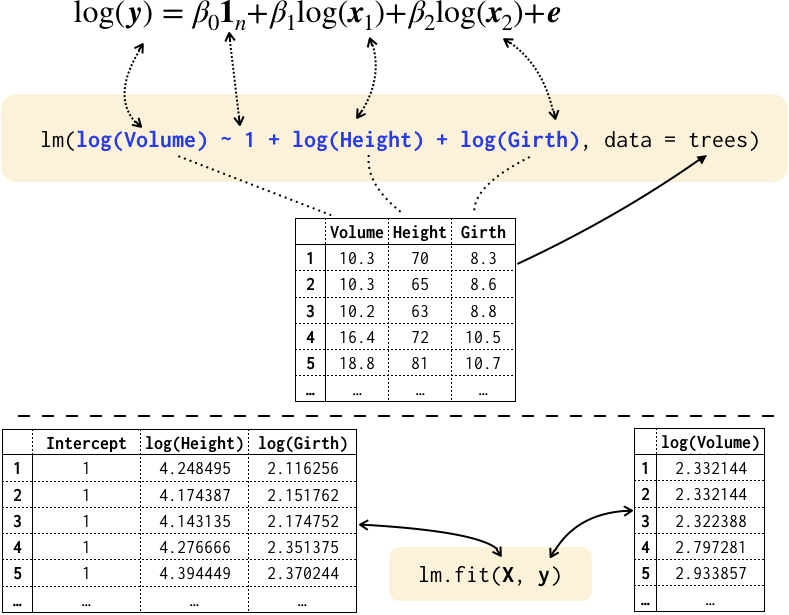
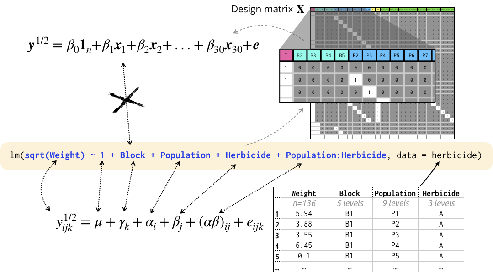
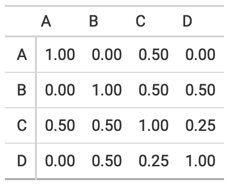
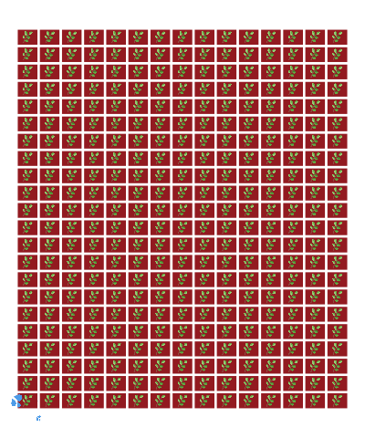
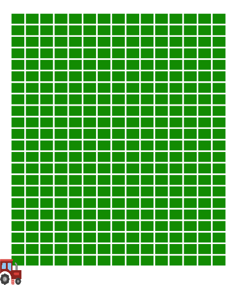
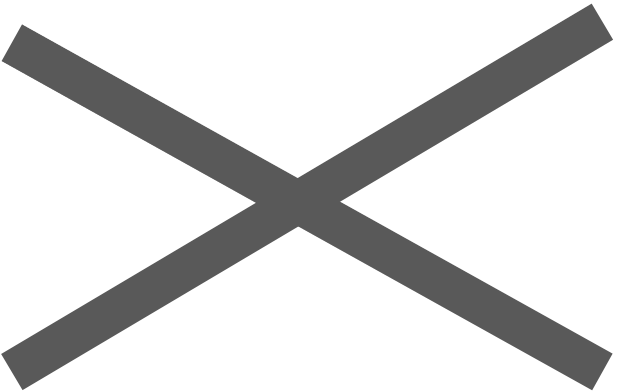

background-image: url("images/bg1.jpg")
background-size: cover
class: hide-slide-number


```{r external, child="setup.Rmd", include=FALSE}
```

:::::::::: { .grid grid: 1fr / 7fr 3fr;} 

::: {.item .shade_black border-right-style: solid; border-right-color: white;}

<br>

# [Symbolic model formulae]{color:#ffc100;} for <br> [linear mixed models]{color:#ffe700;} illustrated with the analysis of [agricultural data]{color:	#e3ff00;}


<div class="font_small" style="float:right;vertical-align: middle;display: table-cell;height:2em;"><a href="https://creativecommons.org/licenses/by-sa/3.0/au/" >Licensed under </a></div>

<br>

Presented by `r rmarkdown::metadata$author`

School of Mathematics and Statistics<br>
`r anicon::faa("envelope", animate="float")`  `r rmarkdown::metadata$email`
`r anicon::faa("twitter", animate="float", speed="fast")`  @statsgen

`r rmarkdown::metadata$date`

:::

::: item 

::: { .bg-yellow  .black .pos width:calc(29.998% - 5px);right:0;bottom:0;padding-left:5px;}
<i class="fas fa-link"></i> The link to these slides will be available at the end.<br>
<!-- <i class="fas fa-exclamation-circle"></i> These slides are viewed best by Chrome and occasionally need to be refreshed if elements did not load properly. See here for <a href="https://www.dropbox.com/s/dsxtrf6r62pevsa/slides.pdf?dl=0" style="color:black!important"/>PDF <i class="fas fa-file-pdf"></i></a>. -->

:::

:::::::::: 


---

::: { .grid grid: 1fr / 7fr 3fr ; height:350px; }

::: item 

# Example: trees

Consider `trees` data with measurements of 

* diameter (`Girth`) in inches $(y)$, 
* `Height` in ft $(x_1)$ and 
* `Volume` in cubic ft $(x_2)$. 

:::

::: item bg-black

```{r, echo=F, fig.height=4, fig.width=4}
ggplot(trees) + geom_point(aes(log(Height), log(Volume)), color="yellow")+ geom_point(aes(log(Girth), log(Volume)), color="white") + labs(x="log(Girth) / <span style = 'color:yellow'>log(Height)</span>") + 
  theme(axis.text = element_text(color="white"),
        axis.title = element_text(color="white"), 
        axis.title.x = element_markdown())
```

<p></p>
:::

:::


::: eqn-black

$$\log(y_i) = \beta_0 + \beta_1\log(x_{i1}) + \beta_2\log(x_{i2}) + e_i$$

:::

for $i = 1, ..., n$ with typically i.i.d. assumption $e_i \sim N(0, \sigma^2)$.


---

class: pad10

<center>

</center>


---

::: grid

::: item 

# Symbolic model formulae 


* Symbolic model formulae is reminiscent of the mathematical equation (minus the effects).


* Allows you to specify the response and the covariates using the column names of the data frame.


* Symbolic model formulae makes it more accessible to users to specify the model they want to fit.

:::

::: item bg-greyish

{{content}}

:::

:::

--

# Design matrix input

* This requires users to construct the design matrix prior to specification in the software.


* Meaningful column names may be lost in construction of design matrix or transformation.


* This effects meaningful output or ability to back-transform / use original scale.

---

::: { .grid grid: 1fr 1fr / 1fr ; height:330px; }

::: item

```{r, echo = FALSE}
herbicide <- rdat::herbicide %>% 
  mutate(Block = factor(Rep),
         Weight = Fwt) %>% 
  select(Population, Herbicide, Weight, Block)
```


# Example: herbicide $\times$ population 

* Herbicide type applied (3 levels)
* Black-grass population (9 levels)
* Factorial-treatment structure, i.e. 27 levels of treatment
* Randomised complete block design (5 replicate blocks)

:::

::: item 

```{r, echo=F, fig.height=4, fig.width=15}
ggplot(herbicide) + geom_tile(aes(interaction(Population, Herbicide), Block, fill = Weight), color = "black", size = 2) + coord_equal() + 
  scale_fill_distiller(palette = "YlGn", 
                       direction = 1) + 
  theme(axis.text.x = element_text(angle = 90, hjust = 1))
```

<p></p>


:::

:::


---

class: pad10

<center>

</center>


---


class: center middle bg-greyish

::: {.box width:90%; } 

The symbolic formula for linear models is well defined in R. E.g. 

* **Simplification**: 
    * `A + B + A = A + B` and 
    * `A:B:A = A:B`
* **Distributive**: `(A + B):C = A:C + B:C`
* **Crossing operator**: `A * B = A + B + A:B`
* **Nesting operator**: `A / B = A + A:B`
* **Deletion operator**: `A * B - A:B = A + B`
* **Exponentiation operator**: <br>`(A + B + C)^2 = A + B + C + A:B + A:C + B:C`


{{content}}

:::

--

What about linear mixed models?


---


# Linear mixed model R-packages

::: { .grid grid: 1fr / 7fr 3fr; }

::: item 

* (Linear) mixed model specifications are quite inconsistent between R packages unlike linear models.


* Biggest difference is in the specification for random effects.


* (Unofficial) survey suggests that [`lme4`]{color:#FF934F!important;} is by far the most popular R package to fit linear mixed models.


* The next popular *frequentist* package is [`nlme`]{color:#FF934F!important;} followed by [`asreml`]{color:#FF934F!important;}.


:::

::: item bg-greyish 

```{r survey, echo=F, fig.width = 5}
survey <- read.csv("assets/survey20190721.csv")
survey %>% 
  mutate(lmm=Which.linear.mixed.model.software.do.you.use.most.) %>% 
  dplyr::filter(lmm!="I don't fit linear mixed models") %>% 
  droplevels() %>% 
  mutate(lmm=forcats::fct_infreq(lmm)) %>% 
  mutate(lmm=forcats::fct_lump(lmm, n=6)) %>% 
  mutate(Method = case_when(
    lmm %in% c("lme4", "nlme", "asreml", "glmm") ~ "Frequentist",
    lmm == "Other" ~ "Other",
    TRUE ~ "Bayesian"
  )) %>% 
  mutate(lmm=forcats::fct_recode(lmm,
    `<span style='color:#FF934F'>lme4</span>` = "lme4",
    `<span style='color:#FF934F'>nlme</span>` = "nlme",
    `<span style='color:#FF934F'>asreml</span>` = "asreml",
    `<span style='color:#FF934F'>glmm</span>` = "glmm"
  ),
  )  %>% 
  ggplot(aes(lmm)) +
  geom_bar(aes(fill = Method)) + 
  theme(axis.text.x = element_markdown(angle=30, vjust=1),
        legend.position = "bottom") + 
  guides(fill=guide_legend(nrow=2,byrow=TRUE)) + 
  scale_fill_manual(values = c("#E1DAAE", "#FF934F", "#CC2D35")) + 
  labs(y="Count", x="R-packages",
       caption="Source: twitter call for survey, result as of 2019/07/21.", 
       title="lme4 is king")
```

:::
::::

---

class: bg-greyish middle center

::: box 

I will focus on `lme4` and `asreml` R packages


But first, let me describe some models used in practice.

:::

---

background-image: url("images/cycle.png")
background-size: 30%
background-position: 50%, 50%

<div class="grid">
<div class="item item-bg" style="background-image:url('images/cornbreeding1.png');">
<br><br><br><br>
<h1>Selective Breeding</h1>
<div class="font_small bottom_abs">
Photo from <a href="https://twitter.com/croplifeintl/status/856843732003561473">CropLife International Twitter</a>
</div>
</div>
<div class="item item-bg">
</div>
<div class="item item-bg" style="background-image:url('images/cornbreeding3.png');">
</div>
</div>


---

background-image: url("images/cycle.png")
background-size: 30%
background-position: 50%, 50%
count: false


<div class="grid">
<div class="item item-bg" style="background-image:url('images/cornbreeding1.png');">
<br><br><br><br>
<h1>Selective Breeding</h1>
<div class="font_small bottom_abs">
Photo from <a href="https://twitter.com/croplifeintl/status/856843732003561473">CropLife International Twitter</a>
</div>
</div>
<div class="item-bg">
<div class="content slideInUp animated slow" style="background-image:url('images/cornbreeding2.png');">
<br><br>
The aim of selective breeding is to increase <b>genetic gain</b>.
<br><br>
<div class="shade_black" style="border-radius:10px;border-style:solid;border-color:black;">

</div>
<br><br><br><br><br><br>
</div></div>
<div class="item item-bg" style="background-image:url('images/cornbreeding3.png');">
</div>
</div>

---

background-color: bg-greyish
class: hide-slide-number


::: {.grid grid: 1fr / 3fr 7fr; }

::: item center bg-greyish 

<br><br>


:::
::: item 

# Aim of plant breeding experiments

* Genetic performance is *not* directly observed.

{{content}}

:::

:::

--


* The use of *appropriate* <span class="indigo">**experimental designs**</span> and <span class="indigo">**statistical models**</span> can predict genetic performance.

{{content}}

--


* Accurate measures of genetic performance will help **increase genetic gain**.

{{content}}

--


* Thus ability to distinguish top genotypes is desirable.


---

background-size: cover
background-image: url('images/narrabri.jpg')
```{r data-1, echo = FALSE}
ncol <- 3
nrow <- 6
nvar <- 4
var_effects <- c(3, 3, 3, 0)
```

:::: { .grid grid: 1fr / 1.8fr 1fr 1fr;}

::: item shade_black

# A Field Trial

* Usually given as a rectangular array.


* Here we have a field trial laid out as `r ncol` columns by `r nrow` rows.


* Each plot is given a treatment - here one of the `r nvar` genotypes.


* There are 3 blocks. 


* Yield is measured for each plot.

:::

::: item shade_black

# &nbsp;

```{r, fig.width=5, fig.height=7, echo =FALSE}
set.seed(2019)
dat1 <- expand.grid(col=1:ncol, row=1:nrow) %>% 
  mutate(Block = ceiling(row / 2)) %>% 
  mutate(Geno = sample(c(rep("A", 2), rep("B", 2), rep("C", 6), rep("D" , 8)))) %>% 
  mutate_if(is.numeric, as.factor) %>% 
  mutate(Geno = as.factor(Geno)) %>% 
  mutate(Yield = 1 + var_effects[as.numeric(Geno)]) 

ggplot(dat1, aes(as.numeric(col), as.numeric(row), label=Geno)) +
  annotate("rect", xmin = 0.5, xmax = 3.5, ymin = c(0.5, 2.5, 4.5), ymax = c(2.5, 4.5, 6.5),
           color = "black", fill = c("#E8F086", "#FF4242", "#235FA4"), size = 2) + 
  geom_tile(aes(fill=Yield), width = 0.8, height = 0.8) + 
  geom_text(aes(color=Geno), size = 10, fontface="bold") + 
  scale_fill_distiller(palette="YlGn", direction = 1) + 
  labs(x = "Column", y = "Row", fill = "Yield", color="Genotype") + 
  annotate("label", x = 2, y = c(1.5, 3.5, 5.5), label = paste("Block", 1:3),
           fontface = "bold", size = 7) +
  whitethm + 
  scale_y_continuous(breaks=1:nrow) + 
  theme(panel.grid.major = element_blank(),
        panel.grid.minor = element_blank()) 
```

:::


::::

---


::: {.grid grid: 1fr / 2fr 8fr; }

::: item font_small bg-greyish


<br><br>

```{r, echo = FALSE}
dat1 %>%  
  select(Block, Geno, Yield) %>% 
  DT::datatable(
              rownames=F,
              options = list(dom = 'tp'),
              height = 480,
              class = 'cell-border stripe compact hover',
                caption = htmltools::tags$caption(
    style = 'caption-side: bottom; text-align: center;',
    htmltools::em('Unrealistic data to illustrate a point.')
  )) 
```


:::
::: item

# Simple example: fixed effects case

$$\texttt{yield}_{ij} = \texttt{block}_i + \texttt{geno}_j + e_{ij}$$

* Suppose fixed `geno` and `block` effects with constraint that $\texttt{geno}_D=0$ then
 $$\hat{\texttt{block}}_1 = \hat{\texttt{block}}_2 =  \hat{\texttt{block}}_3 = 1,$$  $$\hat{\texttt{geno}}_A=\hat{\texttt{geno}}_B= \hat{\texttt{geno}}_C = 3.$$


* You cannot distinguish between the genotypes A, B and C.

::: bottom_abs width100 font_small

See Robinson (1991) That BLUP is a Good Thing: The Estimation of Random Effects *Statistical Science*

:::

:::

::::

---


::: {.grid grid: 1fr / 3fr 7fr; }

::: item bg-greyish

# &nbsp;

Assume for simplicity that:

$$\texttt{geno}_i \sim NID(0, 0.1\sigma^2)$$

$$\texttt{error}_{ij} \sim NID(0, \sigma^2).$$


:::
::: item

# Simple example: random effects case


```{r, include = FALSE}
n <- nrow(dat1)
sigma2 <- 3 # made up - shouldn't change things
y <- dat1$Yield 
X <- model.matrix(~ factor(Block) - 1, dat1)
Z <- model.matrix(~ Geno - 1, dat1)
R <- sigma2 * diag(n)
G <- sigma2 * 0.1 * diag(nlevels(factor(dat1$Geno)))
V <- Z %*% G %*% t(Z) + R
beta_hat1 <- solve(t(X) %*% solve(V) %*% X) %*% t(X) %*% solve(V) %*% y
u_tilde1 <- G %*% t(Z) %*% solve(V) %*% (y - X %*% beta_hat1)
```


Then BLUEs and BLUPs from solving Henderson's mixed model equation are:
:::: grid 
::: item 
$$\texttt{block}_1 = `r sprintf("%.3f", beta_hat1[1])`,\\ \texttt{block}_2 = `r sprintf("%.3f", beta_hat1[2])`,\\ \texttt{block}_3 = `r sprintf("%.3f", beta_hat1[3])`$$
:::
::: item 
$$\texttt{geno}_A = `r sprintf("%.3f", u_tilde1[1])`,\\ \texttt{geno}_B = `r sprintf("%.3f", u_tilde1[2])`,\\ \texttt{geno}_C = `r sprintf("%.3f", u_tilde1[3])`,\\\texttt{geno}_D = `r sprintf("%.3f", u_tilde1[4])`.$$
:::
:::::

So $\texttt{geno}_C$ may be the best selection.

:::

::::

---


::: {.grid grid: 1fr / 3fr 7fr; }

::: item bg-greyish

# &nbsp;

```{r pedtree, echo = FALSE }
DiagrammeR::mermaid("
graph TB
  A(<b>A</b>)-->C(<b>C</b>)
  B(<b>B</b>)-->C
  B-->D(<b>D</b>)
  style A fill:#d11141;
  style A stroke:#000;
  style B fill:#00b159;
  style B stroke:#000;
  style C fill:#0084ff;
  style C stroke:#000;
  style D fill:#f37735;
  style D stroke:#000;
", width = 300)
```

:::

::: item 

# Are genotypes independent?


* We assumed $\texttt{geno}_i \sim NID(0, 0.1\sigma^2)$.


* In practice, there is some **known** relationshional structure between genotypes e.g. via pedigree.


```{r, include = FALSE}
ped <- data.frame(Me = 1:4, 
                  Mum = c(0, 0, 1, 0),
                  Dad = c(0, 0, 2, 2))
Amat <- asreml:::asreml.Ainverse(ped)$ginv %>% 
  asreml:::asreml.sparse2mat() %>% 
  solve()
A <- Amat %>% 
  as.data.frame() %>% 
  mutate_all(~abs(.)) %>% 
  rename(A = V1, B = V2, C = V3, D = V4) %>% 
  mutate_all(~sprintf("%.2f", .)) 
rownames(A) <- LETTERS[1:4]
```

```{r, eval = F, echo = FALSE}
A %>% 
  gt(rownames_to_stub = TRUE) %>% 
  gtsave("images/Amat.png")
```
```{r, echo = FALSE}
G <- sigma2 * Amat
V <- Z %*% G %*% t(Z) + R
beta_hat2 <- solve(t(X) %*% solve(V) %*% X) %*% t(X) %*% solve(V) %*% y
u_tilde2 <- G %*% t(Z) %*% solve(V) %*% (y - X %*% beta_hat2)
```


::::: grid
::: item 
<center>

</center>
:::
::: item 

::: tipmin 
Assume now  
$$\textbf{geno} \sim N(\boldsymbol{0}, \sigma^2_g\mathbf{A})$$ 
where $\mathbf{A}$ is given as in the table.

:::

:::

:::::

:::

:::::

---


::: {.grid grid: 1fr / 3fr 7fr; }

::: item 

# Comparison

```{r, echo = FALSE, ref.label="pedtree", fig.width = 10}
```

:::

::: item 

<br>

```{r, echo = FALSE }
fixed_geno <- c(3, 3, 3, 0)
out <- dat1 %>% 
  group_by(Geno) %>% 
  summarise(Count = n(),
            `Mean` = mean(Yield)) %>% 
  mutate(Fixed = sprintf("%d (%d)", fixed_geno, rank(-fixed_geno, ties.method = "min")),
         `Independent` = sprintf("%.3f (%d)", u_tilde1, rank(-u_tilde1, ties.method = "min")),
         `Dependent` = sprintf("%.3f (%d)", u_tilde2, rank(-u_tilde2, ties.method = "min"))
        )
out %>% 
  gt(rowname_col = "Genotype") %>% 
  tab_stubhead(label = "Genotype") %>% 

  tab_spanner(
    label = "Random",
    columns = vars(`Independent`, `Dependent`)    
  ) %>% 
  tab_style(
    style = cell_text(size = "x-large"),
    locations = list(cells_data(1:6),
                     cells_stub(),
                     cells_column_labels(1:6), 
                     cells_stubhead())
  ) %>% 
  tab_style(
    style = cell_fill(color = "lightcyan"),
    locations = cells_data(4:6)
  )

```

{{content}}


:::

:::::


--

Not subjective of this talk:

* A relationship matrix similar to $\mathbf{A}$ can be calculated from **genetic markers**. 


{{content}}

--


* These capture **additive** genetic effects and **non-additive** effects may also be included.


---

class: middle center bg-greyish

But of course we should all remember that 

::: { .tip width: 50%;}
**All models are wrong, some are useful.**<br><br>
&emsp;&emsp;&emsp;&emsp;- George Box
:::


---


# Fitting fixed effects case in R


::: { .eqn-black width:70%; }
$$\texttt{yield}_{ij} = \texttt{block}_i + \texttt{geno}_j + e_{ij}$$

where $e_{ij} \sim NID(0, \sigma^2)$ and $\texttt{geno}_D =0$.
:::

--- 
::: {.code-black width:70%;}
```{r, eval = FALSE}
fit <- lm(Yield ~ 0 + Block + Geno)
```

(Need to ensure that `D` is the first level in `Geno`.)

:::

---

# Fitting uncorrelated random effects case


::: { .eqn-black width:70%; }
$$\texttt{yield}_{ij} = \texttt{block}_i + \texttt{geno}_j + e_{ij}$$

where $\texttt{geno}_j \sim NID(0, \sigma^2_g)$ and $e_{ij} \sim NID(0, \sigma^2)$.

(Variance components different to before).
:::

--- 
::: {.code-black width:90%;}
```{r, eval = FALSE}
lme_fit <- lme4::lmer(Yield ~ 0 + Block + (1|Geno))
asr_fit <- asreml::asreml(Yield ~ 0 + Block, random = ~idv(Geno))
```
:::

---


::: {.grid grid: 1fr / 7fr 3fr; }

::: item 

# `lme4` (open source)

* Each random effects term is written in the form 
.center[
`(expr|factor)`
]
which evaluates `expr` with the same rule as the linear model formula but corresponding effects are different for each level of `factor`. 


* It is assumed that 
$$\texttt{effect terms} \sim NID(\boldsymbol{0}, \mathbf{\Sigma})$$
where $\mathbf{\Sigma}$ is an unstructured covariance matrix.

:::

{{content}}

::::

--

::: item bg-cyan animated bounceInRight

## Example

`(`<span class="red">`1`</span>`|Geno)`

* <span class="red">`1`</span> relates to intercept $b_0$.


* There is a different effect for each of the 4 levels of `Geno`: $b_{01}, b_{02}, b_{03}, b_{04}$.


* It is assumed that 

$$b_{0i} \sim NID(0, \mathbf{\Sigma}_{1\times 1}).$$

:::

---

::: {.grid grid: 1fr / 7fr 3fr;}

::: item 

# `asreml`  (commerical product)


* Random effects are specified in the argument `random`.
```{r, eval=F}
asreml(y ~ fixed_expr, random=~ random_expr)
```


* The terms in `random_expr` can be wrapped with a "function" that specify the variance structure.


* You can specify structure for residual error too by adding `rcov=~ rcov_expr`.
```{r, eval=F, tidy = FALSE}
asreml(y ~ fixed_expr, random=~ random_expr,
       rcov=~ rcov_expr)
```


:::

{{content}}


:::

--

::: item bg-cyan animated bounceInRight

## Example 

`~idv(Geno)`

means that 

$$var(\texttt{Geno}) = \sigma^2_g \mathbf{I}_4$$

so it is assumed that 

$$\texttt{Geno} \sim N(\boldsymbol{0}, \sigma^2_g \mathbf{I}_4).$$

::: 

---

# Fitting *correlated* random effects case


::: { .eqn-black width:70%; }
$$\texttt{yield}_{ij} = \texttt{block}_i + \texttt{geno}_j + e_{ij}$$

where $\texttt{Geno} \sim N(\boldsymbol{0}, \sigma^2_g\color{red}{\mathbf{A}})$ and $e_{ij} \sim NID(0, \sigma^2)$.

:::

--- 
::: {.code-black width:90%;}
```{r, eval = FALSE, tidy = FALSE}
lme_fit <- pedigreemm::pedigreemm(Yield ~ 0 + Block + (1|Geno),
                                   pedigree = list(Geno = Ped))

asr_fit <- asreml::asreml(Yield ~ 0 + Block, random = ~giv(Geno), 
                          ginverse = list(Geno = Ainv))

```
:::

---


# Example: Chicken Weight 

::: {.grid grid: 1fr / 7fr 3fr; }


::: item 


```{r, echo=F, fig.width=9, height=7}
ChickWeight %>% 
  ggplot(aes(Time, weight)) + 
  geom_text(data = data.frame(
    Time = (max(ChickWeight$Time) + min(ChickWeight$Time))/2,
    weight = (max(ChickWeight$weight) + min(ChickWeight$weight))/2,
    Chick = levels(ChickWeight$Chick)
  ),
    aes(label = Chick), alpha = 0.3, size = 16) + 
  geom_point(aes(color=Diet)) + 
  facet_wrap(~Chick) + 
  theme(strip.text = element_blank())
```
:::

::: item 
```{r}
as_tibble(ChickWeight)
```
<p></p>
:::


:::

---


# Random intercept and random slope model - correlated

::: grid 

::: item 

::: eqn-black

$$y_{ij} = \alpha_{T(i)}+ \color{red}{\beta_0 + x_{ij}\beta_1}+ \color{purple}{b_{0\color{indigo}{i}}+ x_{ij}b_{1\color{indigo}{i}}} + e_{ij}$$

assuming for $i = 1, ..., \texttt{nlevels(Chick)}$ and $j = 1, ..., \texttt{nlevels(Time}_i\texttt{)}$ 
$$\begin{bmatrix} b_{0i}\\ b_{1i} \end{bmatrix}\sim NID\left( \begin{bmatrix} 0 \\ 0 \end{bmatrix}, \begin{bmatrix} \sigma^2_0 & \sigma_{01}\\ \sigma_{01} & \sigma^2_1 \end{bmatrix} \right)$$

$$\text{independent of error }e_{ij} \sim NID(0, \sigma^2).$$

:::

:::

::: item bg-greyish

* $y_{ij}$ is $\texttt{weight}_{ij}$; $x_{ij}$ is $\texttt{Time}_{ij}$;
* $\beta_0, \beta_1$ are overall intercept and slope of time;
* $b_{0i}, b_{1i}$ are random intercept and random slope of time for Chick $i$; 
* $\alpha_{T(i)}$ is the `Diet` effect where $T$ maps `Chick` to `Diet` with $\alpha_1=0$.

:::


:::

---

# Random intercept and random slope model - correlated

::: grid 
::: { .item border-right: dashed 4px black; }
`library(lme4)`
::: {.code-black}
```{r, eval=FALSE, tidy = FALSE}
lmer(weight ~ Diet + 1 + Time + 
             (1 + Time | Chick), 
              data = ChickWeight)
```
:::

Here `(Time|Chick)` relates to effects $b_{0i}$ and $b_{1i}$ and
$$\begin{bmatrix} b_{0i}\\ b_{1i} \end{bmatrix} \sim NID\left(\boldsymbol{0}_2, \mathbf{\Sigma}_{2\times 2}\right).$$

:::

::: item 
`library(asreml)`
::: code-black
```{r, eval=FALSE, tidy = FALSE}
asreml(weight ~ Diet + 1 + Time,
  random =~ str(~Chick + Time:Chick,
                ~us(2):id(50)),
  data = ChickWeight)
```

:::

$$\begin{bmatrix} \boldsymbol{b}_{0}\\\boldsymbol{b}_{1}\end{bmatrix} \sim N\left(\boldsymbol{0}_{100},~~\mathbf{\Sigma}_{2\times 2}\otimes \mathbf{I}_{50}\right).$$

(note intercept is not fitted as default in `str`)

:::
:::

---

# Random intercept and random slope model - uncorrelated

::: grid 
::: { .item border-right: dashed 4px black; }
`library(lme4)`
::: {.code-black}
```{r, eval=FALSE, tidy = FALSE}
lmer(weight ~ Diet + 1 + Time + 
 (1 | Chick) + (0 + Time | Chick), 
              data = ChickWeight)
```
:::

Effects in separate `(.|.)` are uncorrelated so here or can use `(.||.)` if terms are numerical.

:::

::: item 
`library(asreml)`
::: code-black
```{r, eval=FALSE, tidy = FALSE}
asreml(weight ~ Diet + 1 + Time,
  random =~ str(~Chick + Time:Chick,
                ~diag(2):id(50)),
  data = ChickWeight)
```

:::

$$\begin{bmatrix} \boldsymbol{b}_{0}\\\boldsymbol{b}_{1}\end{bmatrix} \sim N\left(\boldsymbol{0}_{100},\begin{bmatrix}\sigma^2_0 & \color{red}{0} \\
\color{red}{0} & \sigma^2_1\end{bmatrix}\otimes \mathbf{I}_{50}\right).$$

:::
:::

---

class: center middle bg-greyish

::: box 

So which one?

{{content}}

:::

--

`asreml` can easily fit variety of variance structures that are better suited for the analysis of plant breeding trials.

---

# Example: Wheat Yield in South Australia

::: grid

::: item 

```{r gilmour, echo = FALSE}
data(gilmour.serpentine, package="agridat")
desplot::desplot(yield ~ col*row, data=gilmour.serpentine,
        num=gen, show.key=FALSE, out1=rep, cex=1.7,
        aspect = 80/180, # true aspect
        main="", gg=T) +
  scale_fill_distiller(palette="YlGn", direction = 1)
```

::: bottom_abs font_small
Gilmour et al. (1997) Accounting for natural and extraneous variation in the analysis of field experiments. *Journal of Agricultural, Biological, and Environmental Statistics* **2** 269-293.
:::

:::
::: item 

* A randomised complete block experiment of wheat in South Australia.


* The numbers represent the genotype number.


* The color represent the yield with darker green higher yield and yellow the lowest. 


:::

::::

---

# Spatial Modelling: Local Trend

::: grid

::: item 

```{r ref.label="gilmour", echo = FALSE}
```

:::
::: item 

$$\texttt{yield}_{ijk} = \texttt{block}_i + \texttt{geno}_j + \texttt{error}_{ijk}$$


* We previously assumed $\texttt{error}_{ijk} \sim NID(0, \sigma^2)$.

**Should it be independent?**

::: tip
Plots that are geographically closer, should be more similar.
:::

:::

::::

---


::: { .grid grid: 1fr / 2fr 8fr; }

::: item bg-greyish

# AR1 $\times$ AR1

<br>

$\rho_r, \rho_c$ are autocorrelation in row, column direction.


$R, C$ are the number of rows, columns


:::
::: item 


* A popular choice for the variance-covariance structure of the error is the **first-order separable autoregressive structure**. 


* Low additional number of parameters to estimate but yet the structure is flexible and anisotropic. 


* For example, the correlation of plots that are two rows apart and three column is $\rho_r^2\rho_c^3$. 


:::

::::

---

# AR1 $\times$ AR1 error structure

::: eqn-black 

$$\texttt{yield}_{ijk} = \texttt{block}_i + \texttt{geno}_j + e_{ijk}$$

where $\texttt{geno} \sim N(\boldsymbol{0},\sigma^2_g \mathbf{A})$ and  $\boldsymbol{e} \sim N(\boldsymbol{0}, \sigma^2 \textbf{AR1} \otimes \textbf{AR1})$

:::

--- 

::: code-black

```{r, eval = F, tidy = FALSE}
asreml(yield ~ 0 + block, 
       random =~ giv(geno),
       rcov =~ ar1v(row):ar1(col),
       ginverse = list(geno = Ainv))
```

<p></p>
::::


---

```{r, include = FALSE}
dat3 <- gilmour.serpentine %>%
  mutate(rowf=factor(row), colf=factor(col))
dat3 <- dat3 %>% arrange(row, col)
fit_ar1xar1 <- asreml::asreml(yield ~ 1, random=~rep + gen, data=dat3, trace=F, 
                     rcov=~ar1v(rowf):ar1(colf))
dat4 <- dat3 %>% 
 mutate(resid=fit_ar1xar1$residuals)
```

# Removing smooth global trends

::: grid 

::: item 

```{r ar1xar1_resid, fig.width=8, fig.height=7, cache=FALSE, echo = FALSE, message = FALSE, warning = FALSE}
dat4 %>% 
 ggplot(aes(col, resid)) + 
 geom_point() + 
 geom_smooth(se=F) + 
 facet_wrap(~paste0("Row ", row), nrow=4) + 
 theme_bw(base_size=18) + 
 labs(x="Column", 
       y="Conditional Residual",
      title = "Residual Plot") 
```
::: 

::: item 

* There is clearly a pattern in the column direction indicating there is some effect in relation to the column we have not removed.


* We can try incorporating **cubic smoothing spline** indexed by the column number to account for this in the model.

:::
:::

---

# Cubic smoothing spline

::: eqn-black 

$$\texttt{yield}_{ijk} = \texttt{block}_i + \underbrace{\mathbf{X}_s\boldsymbol{\beta}_s + \mathbf{Z}_s\boldsymbol{u}_s}_{\text{cubic smoothing spline w.r.t. column}} + \texttt{geno}_j + e_{ijk}$$

where $\texttt{geno} \sim N(\boldsymbol{0},\sigma^2_g \mathbf{A})$,   $\boldsymbol{e} \sim N(\boldsymbol{0}, \sigma^2 \textbf{AR1} \otimes \textbf{AR1})$,  
<details>
$$\mathbf{X}_s = \begin{bmatrix}\boldsymbol{1} & \texttt{col}\end{bmatrix},\quad \mathbf{Z}_s = \mathbf{\Delta}(\mathbf{\Delta}^\top \mathbf{\Delta})^{-1}, \quad \boldsymbol{u}_s \sim N(\boldsymbol{0}, \mathbf{G}_s)\\\Delta_{ii}=\Delta_{i+2, i} = 1,~\Delta_{i+1,i}=-2,~G_{s;i, i + 1}=G_{s;i+ 1, i}=\frac{1}{6},~G_{s;ii} = \frac{2}{3}.$$

</details>
:::


--- 

::: code-black

```{r, eval = F, tidy = FALSE}
asreml(yield ~ 0 + block + lin(col), random =~ giv(geno) + spl(col),
       rcov =~ ar1v(row):ar1(col), ginverse = list(geno = Ainv))
```

<p></p>
::::

--

::: {.bg-white .pos width:50%;top:10px;right:10px;border: solid 2px black;}
```{r, include  = FALSE}
fit <- asreml(resid ~ lin(colf), random=~ spl(colf), data=dat4)
```
```{r, echo = FALSE, fig.width=8, fig.height=7}
dat3 %>% 
  mutate(resid=fit_ar1xar1$residuals,
    fitted = fit$fitted.values, 
    rowname = paste0("Row ", row)) %>% 
  ggplot(aes(col, resid)) + 
  geom_point() + 
  geom_line(aes(y = fitted), color = "red") + 
  facet_wrap(~rowname, nrow = 4) +
  geom_abline(intercept = coef(fit)$fixed[1,1],
                  slope = coef(fit)$fixed[2,1],
              color = "blue", linetype = "dashed", size =1.2) + theme_bw(base_size=18) + 
 labs(x="Column", 
       y="Conditional Residual",
      title = "Residual Plot") 
```

:::

---

# Other extrenous variation?

::: grid

::: item 



:::

::: item 

It's somewhat common to see some column or row effects in field trials so inclusion of random column effects or random row effects may be good. 

:::

::: item 



:::

:::::

---

class: center bg-greyish middle

::: box 

Ideally all possible variation will be accounted at the **experimental design** stage but in practice these are often identified during modelling. 

:::


---

background-size: cover
background-image: url('images/narrabri.jpg')

```{r CAIGE, echo = FALSE}
data("CAIGE", package="rdat")
caige2017 <- CAIGE %>% 
  filter(Year==2017) %>% 
  droplevels()
levels(caige2017$Geno) <- babynames::babynames$name[1:nlevels(caige2017$Geno)]
```


:::: grid

::: item shade_black

# A multi-environment field trial (MET)

* Collection of field trials across time and/or locations.

```{r, fig.width=16, fig.height=6, echo = FALSE}
caige2017 %>% 
  ggplot(aes(Column, Row, fill=Yield)) + 
  geom_tile(size=0.8, color="black") + 
  facet_wrap(~interaction(Year, Location), 
             nrow = 1) +
  scale_fill_distiller(palette="YlGn", direction = 1) +
  theme(axis.text = element_blank(),
        strip.text = element_text(size=16, color="yellow"), 
        panel.grid = element_blank(),
        legend.position = "bottom") +
  whitethm
```
:::

:::

---


# Distribution of genotype-by-site effects

$$\texttt{yield}_{ijk} = \{\texttt{peripheral}\} + \texttt{site}_j + \color{green}{\texttt{geno}_i:\texttt{site}_{j}} + \texttt{error}_{ijk}$$


$$\begin{bmatrix}\texttt{geno}_1:\texttt{site}_{1}\\
\texttt{geno}_1:\texttt{site}_2\\
\texttt{geno}_1:\texttt{site}_3\\
\texttt{geno}_1:\texttt{site}_4\\
\texttt{geno}_1:\texttt{site}_5\\
\vdots\\
\texttt{geno}_{235}:\texttt{site}_7\\
\end{bmatrix}\sim N\left(\begin{bmatrix}
0\\
0\\
0\\
0\\
0\\
\vdots \\
0
\end{bmatrix}, {\qquad\LARGE ???\qquad}\right)$$

---

# Assume separable process

::: font-80

$$Var\begin{bmatrix}\texttt{geno}_1:\texttt{site}_{1}\\
\texttt{geno}_1:\texttt{site}_2\\
\texttt{geno}_1:\texttt{site}_3\\
\texttt{geno}_1:\texttt{site}_4\\
\texttt{geno}_1:\texttt{site}_5\\
\vdots\\
\texttt{geno}_{235}:\texttt{site}_7\\
\end{bmatrix} = \underbrace{Var \begin{bmatrix}
\texttt{geno}_1\\
\texttt{geno}_2\\
\texttt{geno}_3\\
\texttt{geno}_4\\
\texttt{geno}_5\\
\vdots\\
\texttt{geno}_{235}\\
\end{bmatrix}}_{Var(\textbf{geno})}\otimes \underbrace{Var\begin{bmatrix}\texttt{site}_1\\\texttt{site}_2\\\texttt{site}_3\\\texttt{site}_4\\\texttt{site}_5\\\texttt{site}_6\\\texttt{site}_7\end{bmatrix}}_{Var(\textbf{site})}$$

:::

We can assume variance-covariance structure for $Var(\textbf{geno})$ as before. 

---

# MET Model (1) Scaled identity

::: { .grid grid: 1fr / 8fr 2fr; }
::: item 
::: font-80
$$Var\begin{bmatrix}
\texttt{site}_1\\
\texttt{site}_2\\
\texttt{site}_3\\
\texttt{site}_4\\
\texttt{site}_5\\
\texttt{site}_6\\
\texttt{site}_7
\end{bmatrix} = \begin{bmatrix}
\color{green}{\sigma^2_{g}} & 0 & 0 & 0 & 0 & 0 & 0 \\
0 & \color{green}{\sigma^2_{g}} & 0 & 0 & 0 & 0 & 0 \\
0  & 0 & \color{green}{\sigma^2_{g}} & 0 & 0 & 0 & 0 \\
0  & 0 & 0 & \color{green}{\sigma^2_{g}} & 0 & 0 & 0 \\
0  & 0 & 0 & 0 & \color{green}{\sigma^2_{g}} & 0 & 0 \\
0  & 0 & 0 & 0 & 0 & \color{green}{\sigma^2_{g}} & 0 \\
0  & 0 & 0 & 0 & 0 & 0 & \color{green}{\sigma^2_{g}}  \\
\end{bmatrix}$$
:::
Should we constrain these to be the same?
:::
:::

::: {.code-black .pos width:40%;top:5px;right:5px;}
```r
random=~ giv(geno):id(site)
```
:::

::: {.eqn-black .pos width:43%;bottom:5px;right:5px;}
$$\texttt{geno:site} \sim N(\boldsymbol{0}, \sigma^2_g \mathbf{A}\otimes \mathbf{I}_7)$$
:::


---

# MET Model (2) Diagonal structure

::: { .grid grid: 1fr / 8fr 2fr; }
::: item 
::: font-80
$$Var\begin{bmatrix}
\texttt{site}_1\\
\texttt{site}_2\\
\texttt{site}_3\\
\texttt{site}_4\\
\texttt{site}_5\\
\texttt{site}_6\\
\texttt{site}_7
\end{bmatrix} = \begin{bmatrix}
\sigma^2_{\color{green}{1}} & 0 & 0 & 0 & 0 & 0 & 0 \\
0 & \sigma^2_{\color{green}{2}} & 0 & 0 & 0 & 0 & 0 \\
0  & 0 & \sigma^2_{\color{green}{3}} & 0 & 0 & 0 & 0 \\
0  & 0 & 0 & \sigma^2_{\color{green}{4}} & 0 & 0 & 0 \\
0  & 0 & 0 & 0 & \sigma^2_{\color{green}{5}} & 0 & 0 \\
0  & 0 & 0 & 0 & 0 & \sigma^2_{\color{green}{6}} & 0 \\
0  & 0 & 0 & 0 & 0 & 0 & \sigma^2_{\color{green}{7}}  \\
\end{bmatrix}$$
:::

Allow different parameterisation by site.

:::
:::

<div class="shade_black" style="width:40%; position: absolute; top: 4%; right:2%;border-radius: 12px;" >
```{r, echo=F, fig.height=5, echo = FALSE}
ggplot(caige2017, aes(Location, Yield)) +
  geom_violin() + geom_boxplot(width=0.1) +
  whitethm + 
  theme(axis.text.x = element_text(angle = 30, hjust = 1))
```
</div>

::: {.code-black .pos width:40%;bottom:5px;right:5px;}
```r
random=~ giv(geno):diag(site)
```
:::


---


# MET Model (2) Geno across site

::: { .grid grid: 1fr / 7fr 3fr; }
::: item 
::: font-80
$$Var\begin{bmatrix}
\texttt{site}_1\\
\texttt{site}_2\\
\texttt{site}_3\\
\texttt{site}_4\\
\texttt{site}_5\\
\texttt{site}_6\\
\texttt{site}_7
\end{bmatrix} = \begin{bmatrix}
\sigma^2_1 & \color{green}{0} & \color{green}{0} & \color{green}{0} & \color{green}{0} & \color{green}{0} & \color{green}{0} \\
\color{green}{0} & \sigma^2_2 & \color{green}{0} & \color{green}{0} & \color{green}{0} & \color{green}{0} & \color{green}{0} \\
\color{green}{0}  & \color{green}{0} & \sigma^2_3 & \color{green}{0} & \color{green}{0} & \color{green}{0} & \color{green}{0} \\
\color{green}{0}  & \color{green}{0} & \color{green}{0} & \sigma^2_4 & \color{green}{0} & \color{green}{0} & \color{green}{0} \\
\color{green}{0}  & \color{green}{0} & \color{green}{0} & \color{green}{0} & \sigma^2_5 & \color{green}{0} & \color{green}{0} \\
\color{green}{0}  & \color{green}{0} & \color{green}{0} & \color{green}{0} & \color{green}{0} & \sigma^2_6 & \color{green}{0} \\
\color{green}{0}  & \color{green}{0} & \color{green}{0} & \color{green}{0} & \color{green}{0} & \color{green}{0} & \sigma^2_7  \\
\end{bmatrix}$$
:::

::: item 
So same genotype across site is uncorrelated. 


E.g. $cov(\texttt{geno}_1:\texttt{site}_1, \texttt{geno}_1:\texttt{site}_2) = 0$.
::: 
:::
:::

::: {.code-black .pos width:40%;bottom:5px;right:5px;}
```r
random=~ giv(geno):diag(site)
```
:::


---


# MET Model (3) Unstructured

::: { .grid grid: 1fr / 8fr 2fr; }
::: item 
::: font-80
$$Var\begin{bmatrix}
\texttt{site}_1\\
\texttt{site}_2\\
\texttt{site}_3\\
\texttt{site}_4\\
\texttt{site}_5\\
\texttt{site}_6\\
\texttt{site}_7
\end{bmatrix} = \begin{bmatrix}
\sigma^2_{1} & \sigma_{12}  & \sigma_{13}  & \sigma_{14}  & \sigma_{15}  & \sigma_{16}  & \sigma_{17} \\
\sigma_{12}  & \sigma^2_{2} & \sigma_{23}  & \sigma_{24}  & \sigma_{25}  & \sigma_{26}  & \sigma_{27} \\
\sigma_{13}  & \sigma_{23}  & \sigma^2_{3} & \sigma_{34}  & \sigma_{35}  & \sigma_{36}  & \sigma_{37} \\
\sigma_{14}  & \sigma_{24}  & \sigma_{34}  & \sigma^2_{4} & \sigma_{45}  & \sigma_{46}  & \sigma_{47} \\
\sigma_{15}  & \sigma_{25}  & \sigma_{35}  & \sigma_{45}  & \sigma^2_{5} & \sigma_{56}  & \sigma_{57} \\
\sigma_{16}  & \sigma_{26}  & \sigma_{36}  & \sigma_{46}  & \sigma_{56}  & \sigma^2_{6} & \sigma_{67} \\
\sigma_{17}  & \sigma_{27}  & \sigma_{37}  & \sigma_{47}  & \sigma_{57}  & \sigma_{67} & \sigma^2_{7}  \\
\end{bmatrix}$$
:::

Now say $cov(\texttt{geno}_1:\texttt{site}_1, \texttt{geno}_1:\texttt{site}_2) = Var(\texttt{geno}_1)\cdot \sigma_{12}$.
:::

:::

::: {.code-black .pos width:40%;bottom:5px;right:5px;}
```r
random=~ giv(geno):us(site)
```
:::

---

# Which `lme4` model is equivalent to `asreml` model?

<center>
<pre>lmer(yield ~ site + (site - 1 | gen))</pre>
</center>
<br>

::: {.grid grid: 220px 220px / 1fr 1fr;}

::: { .item .code-black2 border: solid 3px black;background-color: #e6ffcc; }
## A) 
```r
asreml(yield ~ site, 
      random=~ id(gen):diag(site))
```

::: 

::: { .item .code-black2 border: solid 3px black;background-color: #ffffcc; }
## B) 
```r
asreml(yield ~ site, 
      random=~ id(gen):us(site))
```

:::

::: { .item .code-black2 border: solid 3px black;background-color: #ffffcc; }
## C) 
```r
asreml(yield ~ site, 
      random=~ idv(gen):id(site))
```

::: 

::: { .item .code-black2 border: solid 3px black;background-color: #e6ffcc; }


## D) 

None of the others.

:::

:::

---

## Explanation `lmer(yield ~ site + (site - 1 | gen))`

::: grid 

::: item 

* Recall that `site` is a factor with 6 levels.


* `~ site - 1` in mathematical notation is
$$z_{1}u_1 + z_{2}u_2 + z_{3}u_3+ z_{4}u_4 +  z_{5}u_5 + z_{6}u_6$$
where $z_i = \begin{cases}1\quad\text{if  observation is in site } i\\0 \quad\text{otherwise.}\end{cases}$  


* `(site - 1 | gen)` means that random effects are $(u_{1j}, u_{2j}, u_{3j}, u_{4j}, u_{5j}, u_{6j})^\top$ for genotype $j = 1, ..., n$.

:::

::: item bg-greyish

* Recall the effect terms within LHS are correlated such that 
$$\begin{bmatrix} u_{1j}\\ u_{2j}\\ \vdots \\  u_{6j} \end{bmatrix}\sim NID\left(\boldsymbol{0}, \mathbf{\Sigma}_{6\times 6}\right)$$
where $\mathbf{\Sigma}_{6\times 6}$ is a $6\times 6$ unstructured covariance matrix.


:::

:::

---

class: center middle bg-greyish

::: tip 

In practice, the separable model and unstructured for $Var(\textbf{site})$ works well. 

:::

--

But what if we have too many sites?

--

::: tip 

In practice, the separable model and **factor-analytic structure** $(\mathbf{\Lambda}\mathbf{\Lambda}^\top + \mathbf{\Psi})$  for $Var(\textbf{site})$ works well. 

:::



--

::: { .code-black .pos top:50px; left:25%;width:50%;height:160px;padding-top:60px;}

```{r, eval = FALSE, tidy = FALSE}
asreml(yield ~ site, 
       random=~ id(gen):fa(site))
```
<p></p>
:::

---

class: center middle bg-greyish

# Summary

::: box

* In practice, there may be even more models we consider in the analysis of plant breeding data, e.g. taking into account
  * genetic data; 
  * multi-phase experiments; 
  * multi-trait data; 
  * temporal components;
  * and so on.


* Hence it is **critical that software is flexible to allow practitioners to fit variety of models**.

:::


---

class: center middle bg-greyish


::: box

* Most research efforts for effective analysis are based on enhancing a (statistical) method.


* But in this talk alone we needed to be able to fit
  * crossed random effects 
  * known covariance structures 
  * unstructured variance structure
  * diagnoal variance structure
  * cubic splines and 
  * separable models.
  
  
* These **variance structures are complex and care is needed by the practitioner to even fit the desired model**, let alone the difficulty already in identifying the appropriate model.

:::


---

background-image: url("images/bg1.jpg")
background-size: cover


::: {.grid grid: 1fr / 8fr 2fr; }

::: item shade_black

That concludes the review of the **symbolic model formulae for linear mixed models illustrating with analysis of agricultural data**... no time for part 2 sorry (please invite me back next year).

:::

::::

---

count: false

background-image: url("images/bg1.jpg")
background-size: cover


::: {.grid grid: 1fr / 8fr 2fr; }

::: item shade_black

That concludes the review of the **symbolic model formulae for linear mixed models illustrating with analysis of agricultural data**... no time for part 2 sorry (please invite me back next year).


# Thanks!

`r anicon::faa("link", animate="none")` These slides, made using [xaringan](https://github.com/yihui/xaringan) R-package, can be found at
.center[
[emitanaka.org/slides/MQ2019](https://emitanaka.org/slides/MQ2019)
]
<p>

`r anicon::faa("envelope", animate="float")` &nbsp;`r rmarkdown::metadata$email`
`r anicon::faa("twitter", animate="float", speed="fast")` &nbsp;@statsgen


:::

::: item 

:::

:::::

---

class: bg-black white hide-slide-number

# Session Information

:::: scroll-400
```{r, include = FALSE}
options(width = 1000)
```


```{r}
devtools::session_info()
```

<p></p>
:::


These slides are licensed under <br><center><a href="https://creativecommons.org/licenses/by-sa/3.0/au/"></a></center>

You can find the source files for my talks at https://github.com/emitanaka/talks
