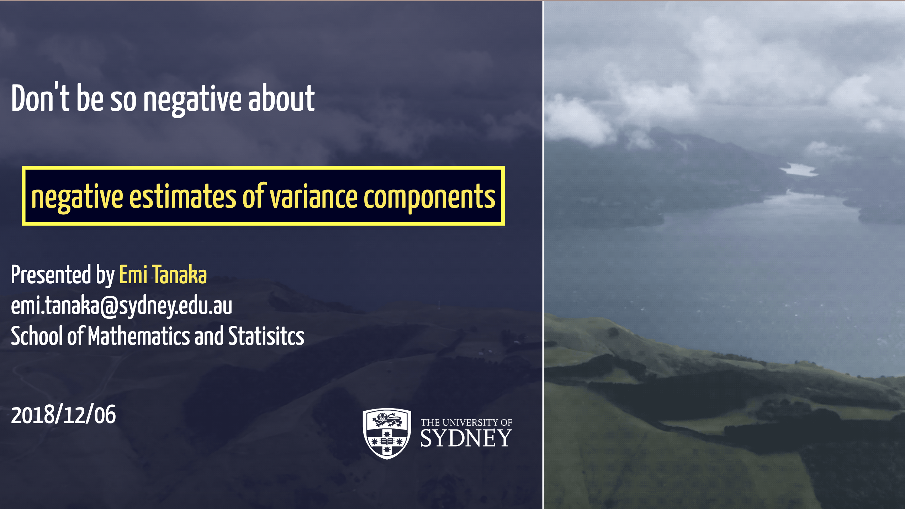
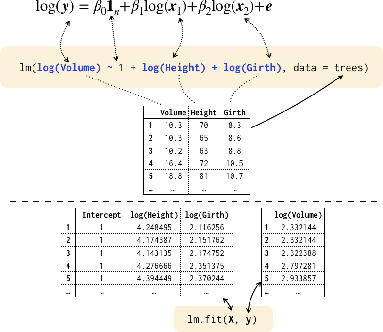
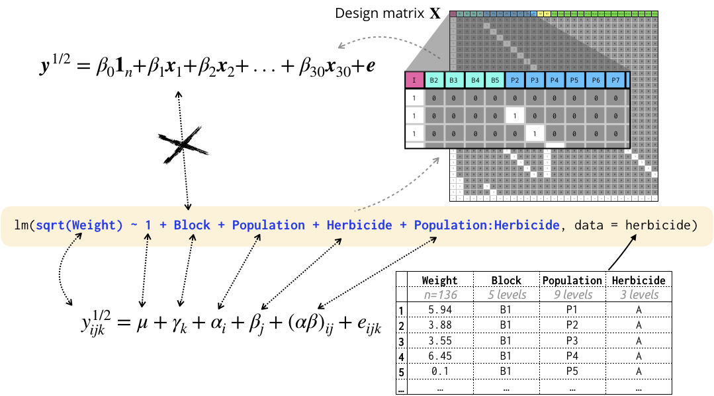
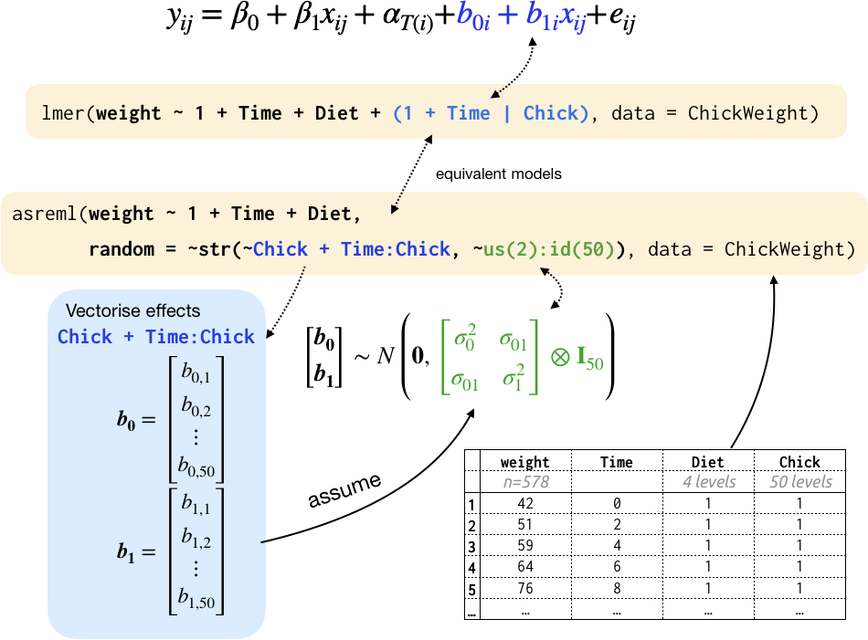
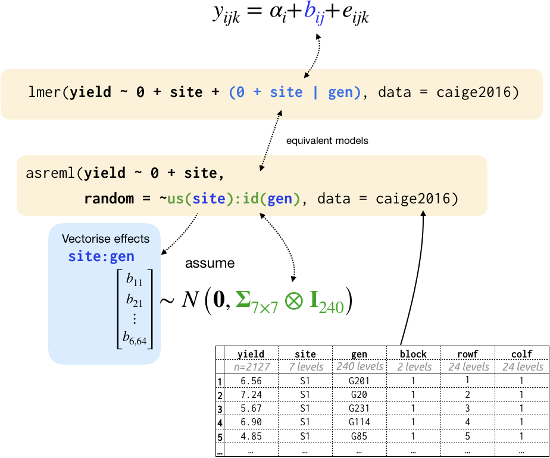

```{r external, child="scripts/setup.Rmd", include=FALSE}
```
```{r titleslide, child="scripts/titleslide.Rmd"}
```

---

```{r monash-titleslide, child="scripts/monash-titleslide.Rmd"}
```

---

class: bg-black center-items

::: {.grid grid: 1fr 1fr 1fr / 1fr 1fr 1fr; padding-top:20px;}


::: item
<a href='http://emitanaka.org/slides/MonashEBSRetreat2019/notavailable.html'></a>
:::
::: item
<a href='https://bit.ly/choosemaths2019'></a>
:::
::: item
<a href='https://bit.ly/ecosta2019'></a>
:::
::: item
<a href='http://emitanaka.org/slides/MonashEBSRetreat2019/notavailable.html'></a>
:::
::: item
<a href='https://bit.ly/tanaka-rssds2019'></a>
:::
::: item
<a href='https://bit.ly/tanaka-isiwsc2019'></a>
:::
::: item
<a href='https://bit.ly/tanaka-sia2019'></a>
:::
::: item
<a href='https://emitanaka.org/slides/ANU2019'></a>
:::
::: item
<a href='https://emitanaka.org/slides/MQ2019'></a>
:::
:::

---


# Symbolic Formulae for Linear Models
<br>
<center>

</center>

---

# Symbolic Formulae for Linear Models (factor)
<br>
<center>

</center>

---

# Symbolic Formulae for Linear Mixed Models 
<br>
<center>

</center>

---

# Symbolic Formulae for Linear Mixed Models 
<br>
<center>

</center>

---

class: pad10 bg-indigo white

# Summary 

* Symbolic formulae (usually) resembles corresponding model equation.
--

* Do you have a great method for fitting a statistical model? <br> Make it accessible for practitioners to use your method!
--

* Consider reading (and citing) review and discussion from our paper:

.center[

**Symbolic Formulae for Linear Mixed Models**

by E. Tanaka and F.K.C. Hui 

<i class="fas fa-link"></i> [Submitted version](https://github.com/emitanaka/paper-symlmm/blob/master/paper_symlmm.pdf)

]


---

```{r endslide, child="scripts/endslide.Rmd"}
```

