```{r, include = FALSE}
current_file <- knitr::current_input()
basename <- gsub(".Rmd$", "", current_file)

knitr::opts_chunk$set(
  fig.path = "images/",
  fig.width = 6,
  fig.height = 4,
  fig.align = "center",
  fig.retina = 3,
  echo = TRUE,
  warning = FALSE,
  message = FALSE#,
  #cache = TRUE,
  #cache.path = "cache/"
)
```


class: middle center hide-slide-number monash-bg-gray80


```{r, include = FALSE}
basename <- ifelse(exists("basename"), basename, "slide")
pdflink <- ifelse(is.null(rmarkdown::metadata$pdflink),
                  paste0(basename, ".pdf"),
                  rmarkdown::metadata$pdflink)
```


.info-box.w-50.bg-white[
These slides are viewed best by Chrome or Firefox and occasionally need to be refreshed if elements did not load properly. See <a href="`r pdflink`">here for the PDF <i class="fas fa-file-pdf"></i></a>. 
]

<br>

.white[Press the **right arrow** to progress to the next slide!]


---


background-size: cover
class: title-slide
count: false

# .monash-blue[`r rmarkdown::metadata$title`]

<br>

<h2 style="font-weight:900!important;">`r rmarkdown::metadata$subtitle`</h2>

.bottom_abs.width100[

Presenter: *`r rmarkdown::metadata$author`*

<i class="fas fa-university"></i> `r rmarkdown::metadata$department`, <Br>&nbsp;&nbsp;&nbsp;&nbsp;&nbsp;Monash University, Melbourne, Australia

<i class="fas fa-envelope"></i>  `r rmarkdown::metadata$email`

<a href="https://twitter.com/statsgen" style="color:black"><i class="fab fa-twitter"></i> @statsgen</a>

<i class="fas fa-calendar-alt"></i> `r rmarkdown::metadata$date`

<br>

]


---

class: footer-slide
layout: true
name: footer


.footnote.monash-black.f4[
<i class="fas fa-link"></i> スライドは <a href="https://emitanaka.org/slides/TokyoR2021" style="color:#6F7C4D!important;">emitanaka.org/slides/TokyoR2021</a>
]

---


# A little about me 

# 自己紹介

* オーストラリア育ちの日本語がイマイチなJapanese-Australianです🇯🇵🇦🇺
--

* ５年前に統計学の博士号を取得しました🎓
--

* Monash大学で働くため２０２０年１月シドニーからメルボルンへ引っ越しました📦
--


<center>

　私のオフィスからの見晴らしです<i class="fas fa-arrow-right"></i>　
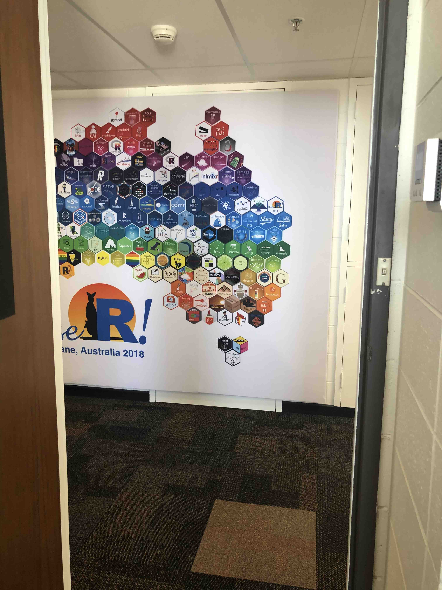

</center>


---

# その研究内容一つとは

<br><br>

.f1.center[
.animated.bounce[
.monash-blue[<b><i class="fas fa-project-diagram"></i> Grammar of Experimental Design</b>]

実験計画法の「文法」
]

{{content}}
]

--

<br><br>

「文法」とはどういう意味なのでしょうか？


---

# 内容

<br>

.f1[

.circle.monash-bg-blue.white[1] <b><i class="fas fa-chart-bar"></i> Grammar of Graphics</b> .f3[グラフィクスの文法]
<br><br>

.circle.monash-bg-blue.white[2] <b><i class="fas fa-wrench"></i> Grammar of Data Manipulation</b> .f3[データ操作の文法]<Br>
<br>


.circle.monash-bg-blue.white[3] .monash-blue2[<b><i class="fas fa-project-diagram"></i> Grammar of Experimental Design</b>] .f3[実験計画法の文法]


]

---

class: transition  animated slideInLeft

# .circle-big[1] 

# Grammar of Graphics


.f3.center.w-100[

Wickham (2016) ggplot2: Elegant Graphics for Data Analysis. *Springer-Verlag New York*

Wilkinson (2005) The Grammar of Graphics. *Statistics and Computing. Springer, 2nd edition.*<br><br>
]


---


class: middle 

まずはデーターから

.f-headline[
👩🏻‍🏫
]

.measure.f2.pa3[
一般的なオーストラリアの大学で働いてる学者は時間を以下のように分けるよう期待されています：
* 40％教育、
* 40％研究と
* 20％その他。
]

---

# この二つのプロットの違いとは？


.flex[
.w-50[
```{r, echo = F, message = FALSE, warning = FALSE, fig.width = 5, fig.height = 6.7}
library(tidyverse)
filter <- dplyr::filter
df <- tribble(     ~duty, ~perc,
              "Teaching",    40,
              "Research",    40,
                 "Other",    20) %>% 
  as.data.frame()
barplot(as.matrix(df$perc),
        legend = df$duty)
```

]
.w-50[

```{r, echo = F, fig.width = 6.7, fig.height = 6.7}
pie(df$perc, labels = df$duty)
```


]
]

---

name: base-plot
class: font_smaller

# Base R

.flex.h-80[
.w33.br[
```{r}
df

tibble::as_tibble(df)
```
]
.w33.br[

```{r barplot, echo = TRUE, fig.width = 4, fig.height = 5}
barplot(as.matrix(df$perc),
        legend = df$duty)
```


]
.w33[

```{r pie, echo = TRUE, fig.width = 6, fig.height = 6}
pie(df$perc, labels = df$duty)
```


]
]

.footnote.monash-black.f4[
<i class="fas fa-book"></i> R Core Team (2020) R: A Language and Environment for Statistical Computing https://www.R-project.org/
<br><br>
]

<div class="show-on-hover" style="padding:10px;position:absolute;bottom: 40px; right: 10px;">
<a href="#edibble" style="font-size:12pt"><i class="fas fa-caret-right"></i> edibble</a>
</div>

--

.absolute.bottom-3.left-1[
.info-box.w-60[
Single purpose functions to generate "named plots"
]]

---

# `ggplot2`


.flex.h-80[
.w-33.br[
```{r}
df

tibble::as_tibble(df)
```
]
.w-33.br.f4[

```{r ggbarplot, echo = TRUE, fig.width = 5, fig.height=4}
ggplot(df, aes(x = "", # dummy
               y = perc, 
               fill = duty)) + 
  geom_col()
```


]
.w-33.f4[


{{content}}

]
]

--

```{r ggpie, echo = TRUE, fig.width = 5, fig.height = 4}
ggplot(df, aes(x = "", # dummy
               y = perc, 
               fill = duty)) + 
  geom_col() + 
  coord_polar(theta = "y") #<<
```

--

.absolute.bottom-2.left-1[
.info-box.w-60[
**stacked barplot**と**pie chart**の違いはcoordinate systemが**Cartesian coordinate**から**polar coordinate**と変わった
]]


---

# <i class="fas fa-puzzle-piece"></i> ポテトフィールド研究・このプロットはどうコードする？


.flex[
.overflow-scroll.h---500.w-33[
```{r, echo = FALSE}
df2 <- tibble(duty = c("Teaching", "Research", "Admin", "Teaching", "Research", "Admin"),
              perc = c(40, 40, 20, 80, 0, 20),
              type = rep(c("standard", "teaching"), each = 3))
```
```{r}
data(cochran.crd,
     package = "agridat")

cochran.crd
```

]
.w-33.h-50[

```{r field1, echo = FALSE, fig.width = 4, fig.height = 3}
ggplot(cochran.crd, 
       aes(x = col, 
           y = row, 
           fill = inf)) + #<<
  geom_tile(color = "black", size = 1.2) + 
  scale_fill_gradient(low = "gold", #<<
                      high = "firebrick4") + #<<
  theme(text = element_text(size = 20))
```
```{r field2, echo = FALSE, fig.width = 4, fig.height = 3}
ggplot(cochran.crd, 
       aes(x = col, 
           y = row, 
           fill = trt)) + #<<
  geom_tile(color = "black", size = 1.2) +
  scale_fill_viridis_d() + #<<
  theme(text = element_text(size = 20))
```

]
.h-50.w-33.f6[

{{content}}

]
]

.footnote.monash-black.f6[
<i class="fas fa-book"></i> Kevin Wright (2020). agridat: Agricultural Datasets. R
  package version 1.17.<br>
<i class="fas fa-book"></i> W.G. Cochran and G. Cox, 1957. Experimental Designs, 2nd ed. John Wiley, New York.
<br><br><br>
]

--

```{r field1, eval = FALSE}
```

<br>
<br>
<br>

```{r field2, eval = FALSE}
```


---

class: transition  animated slideInLeft

# .circle-big[2] 

# Grammar of <br>Data Manipulation


.center.f3.w-100[
Wickham, François, Henry & Müller (2020) dplyr: A Grammar of Data Manipulation. R-package version 1.0.0.
]

---

# このコードは何をしてる？アウトプットは何を期待しますか？

.flex.h-80[
.w-50.h---500.overflow-scroll.br[
.f4[
```{r}
tapply(cochran.crd$inf, cochran.crd$trt, mean)
tapply(cochran.crd$inf, cochran.crd$trt, sd)
tapply(cochran.crd$inf, cochran.crd$trt, 
       function(x) c(avg = mean(x), sd = sd(x)))

```
]
]
.w-50.f4[
{{content}}
]
]

--

```{r}
library(dplyr)
cochran.crd %>% 
  group_by(trt) %>% 
  summarise(avg = mean(inf),
             sd = sd(inf))
```

--

.absolute.bottom-3.right-1[
.info-box.w-60[
右の方が意図が分かりやすいです
]]


---

class: transition animated slideInLeft

# .circle-big[3] 

# Grammar of <br>Experimental Design

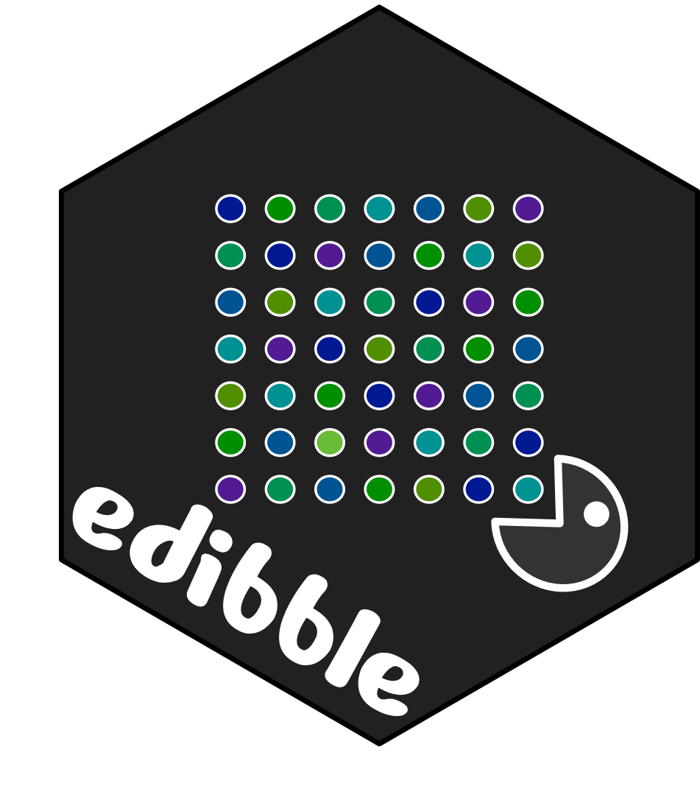

<i class="fas fa-wrench"></i> Work-In-Progress

---


# 実験計画法の一般的なコース <br>.font_small[(例えばシドニー大学2017-2019)]


教える内容：

* Completely Randomised Design
* Randomised Complete Block Design
* Latin Square Design
* Balanced Incomplete Block Design
* Factorial Design
* <strike> 2</strike><sup>k</sup><strike> Factorial Design</strike> .font_small[(２０１８年以降取り除いた)]
* Split-plot Design .font_small[(私が２０１８年に追加した)]

---


# Completely Randomised Design (CRD)

.grid[

.item[ 

<br>

<center>
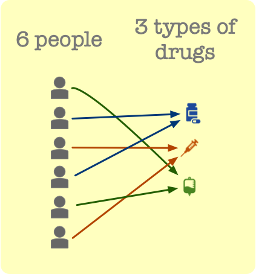
</center>

]

.item[ 

* $t$ treatments randomised to $n$ units

<br>

.model-box[

$$\scriptsize \texttt{observation} = \texttt{mean} + \texttt{treatment} + \texttt{error}$$

.font_small[(with constraints and distributional assumptions)]

<br>
<center>

</center>

]


]

]

---

# Randomised Complete Block Design (RCBD)

.grid[

.item[ 


<br>

<center>
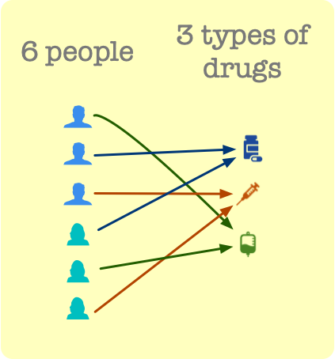
</center>

]

.item[ 

* $b$ blocks of size $t$
* $t$ treatments randomised to $t$ units within each block


.model-box[

$$\scriptsize \texttt{observation} = \texttt{mean} + \texttt{treatment} + \texttt{block} + \texttt{error}$$


<center>

</center>


]

]

]

---

# Latin Square Design (LSD)

.grid[

.item[ 


<br>

<center>
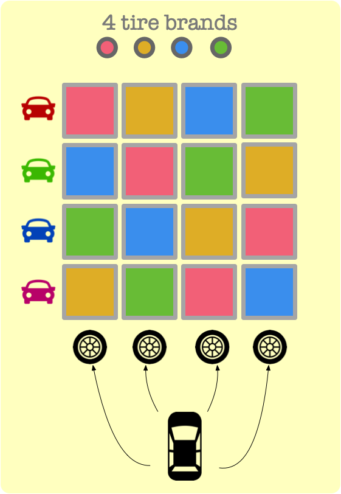
</center>

]

.item[ 

* two orthogonal blocks of size $t$
* $t$ treatments randomised to units such that every treatment appears exactly once in each block


.model-box[

$$\scriptsize \texttt{observation} = \texttt{mean} + \texttt{treatment} + \texttt{row} + \texttt{column} + \texttt{error}$$


<center>

</center>

]

]

]

---

# Balanced Incomplete Block Design (BIBD)
 
.grid[

.item[ 


<br>

<center>
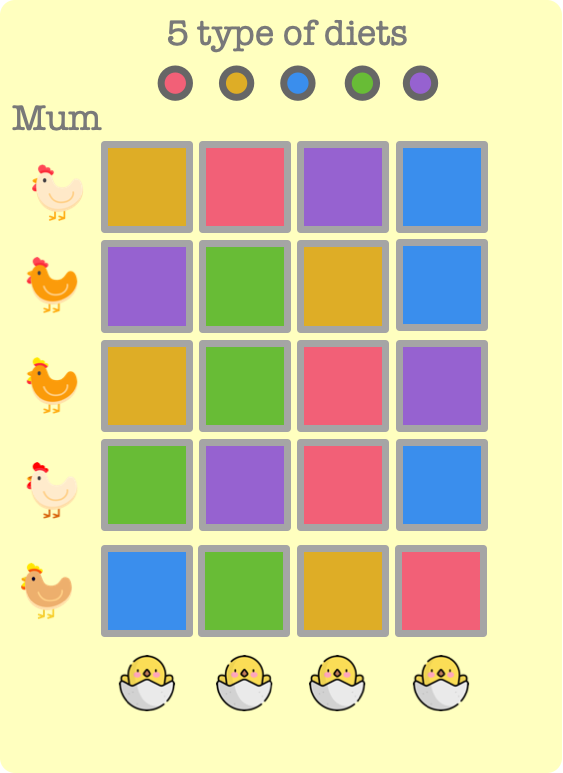
</center>

]

.item[ 

* $b$ blocks of size $k < t$
* $t$ treatments randomised to units within each block such that every pair of treatment appears the same number of times across blocks


.model-box[

$$\scriptsize \texttt{observation} = \texttt{mean} + \texttt{block} + \texttt{treatment} + \texttt{error}$$


<center>

</center>

]

]

]

---

# Factorial Design 

.grid[

.item[ 


<br>

<center>
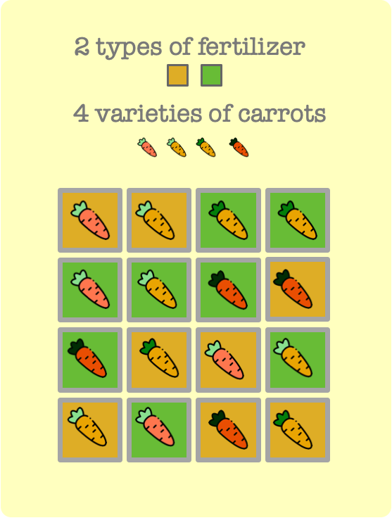
</center>

]

.item[ 

* $ab = t$ treatments randomised to $n$ units
* treatment is every combination of two factors A and B


.model-box[

$$\scriptsize \texttt{observation} = \texttt{mean} + \texttt{A} + \texttt{B} + \texttt{A:B} + \texttt{error}$$

<center>

<details style="font-size:4pt"><summary></summary>

</details>

</center>
]

]

]

---

# Split-plot Design 

.grid[

.item[ 

<br>

<center>
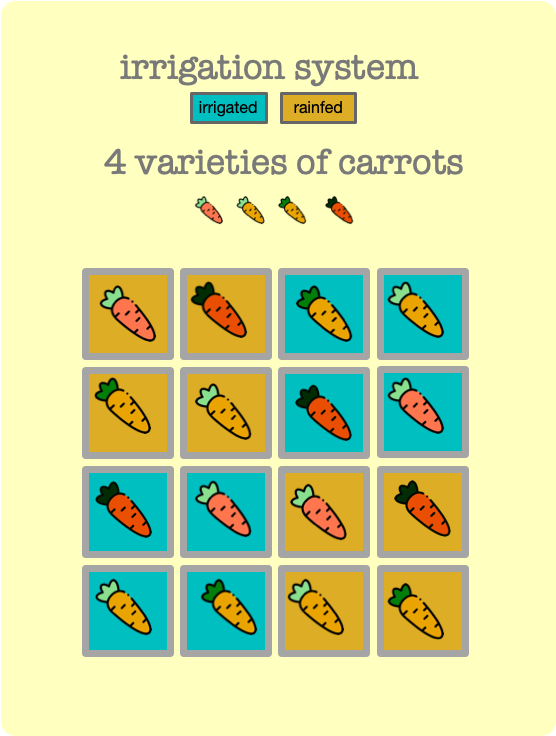
</center>

]

<div class="item" style="font-size: 0.85em">

<ul>
<li> \(n_1\) whole plots consisting of \(b\) sub plots</li>
<li>in total there are \(n\) sub plots</li>
<li>treatment factor A is randomised to whole plots</li>
<li>treatment factor B is randomised to sub plots within each whole plot</li>
</ul>

.model-box[

$$\scriptsize \texttt{observation} = \texttt{mean} + \texttt{A} + \texttt{WP} + \texttt{B} + \texttt{A:B} + \texttt{error}$$

<center>
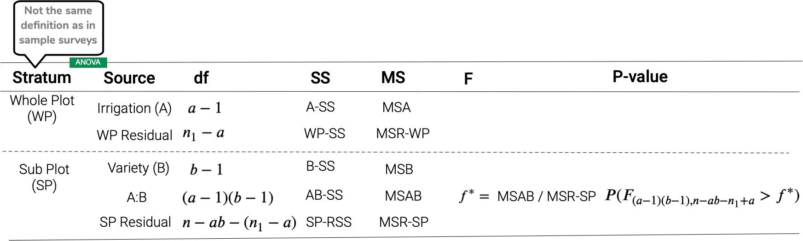
</center>
]

</div>

]


---

class: transition center middle


# CRAN Task View of <Br>Design of Experiments
```{r doe-cran, cache = T, echo = FALSE}
dat <- xml2::read_html("https://cran.r-project.org/web/views/ExperimentalDesign.html")
date_download <- Sys.Date()
cran_names <- rownames(available:::available_packages(repos = available:::default_cran_repos))
doe_pkgs <- dat %>% 
  rvest::html_nodes("li") %>% 
  rvest::html_nodes("a") %>% 
  rvest::html_text() %>% 
  #.[stringr::str_detect(., "\\n", negate = T)] %>% 
  .[. %in% cran_names]
```


contains

# `r emo::ji("package")` .yellow[`r length(doe_pkgs)` R-packages ]


.font_small[as of `r date_download`]


.font_small[(Please note that there may be some webscrapping error)]

---


# ダウンロードされたR-packagesトップ１０


```{r top10_2019, cache = TRUE, fig.height = 5, echo = FALSE, message = FALSE}
invthm <- theme_minimal() +
  theme(
    panel.background  = element_rect(fill = 'transparent', colour = NA),
    plot.background   = element_rect(fill = 'transparent', colour = NA),
    legend.background = element_rect(fill = 'transparent', colour = NA),
    legend.key        = element_rect(fill = 'transparent', colour = NA),
    axis.title        = element_text(size = 18),
    axis.text         = element_text(size = 16),
    strip.text        = element_text(size = 20)
  )

pkgs <- c("agricolae", "AlgDesign", "DoE.base", "ez", "lhs", "rsm", "FrF2", 
"conf.design", "BsMD", "DiceKriging")
start <- "2015-01-01"
end <- "2020-12-31"
dldat <- cranlogs::cran_downloads(pkgs, from=start, to = end)
dldat2 <- dldat %>% 
  mutate(month = lubridate::month(date)) %>% 
  group_by(month, package) %>% 
  summarise(downloads = sum(count)) %>% 
  ungroup() %>% 
  mutate(month = forcats::fct_inorder(month.abb[month]))

#dldat2 %>% 
#  ggplot(aes(x = month, y = downloads, fill = package)) + 
#    geom_col() + coord_polar()

dldat2 %>% 
  mutate(package = forcats::fct_reorder(package, downloads, sum)) %>% 
  ggplot(aes(x = package, y = downloads/10000, fill = month)) + 
  geom_col(color = "black") + 
  #scale_fill_manual(values = RColorBrewer::brewer.pal(12, "Set3")) + 
  coord_flip() + invthm +
  labs(y = "downloads (10k)") +
  colorspace::scale_fill_discrete_qualitative()
```
.center[
.f2[`AlgDesign` and `agricolae` are the most downloaded]

.f3[(data from `cranlogs` from `r start` to `r end`)]
]

---

class: font_small

# `agricolae::design.crd`

**Completely randomised design** for $t = 3$ treatments with $2$ replicates each
<pre><code>
trt <- c("A", "B", "C")
agricolae::.bg-yellow[design.crd](trt = trt, r = 2) %>% glimpse()
</code></pre>

.overflow-scroll.h---340[
```{r, echo = FALSE}
trt <- c("A", "B", "C")
des <- agricolae::design.crd(trt = trt, r = 2) 
glimpse(des)
```
]

```{r ggcrd, fig.height = 3, fig.width = 3, fig.show="hide", echo = FALSE}
ggplot(des$book, aes(x = factor(plots), y = "", fill = trt)) + 
  geom_tile(color = "black", size = 1.2) + 
  coord_equal() +
  theme_void(base_size = 18) + 
  theme(legend.position = "bottom",
        legend.direction = "vertical")
```

<div class="plot-box" style="position:absolute;top: 35%; right: 50px;">

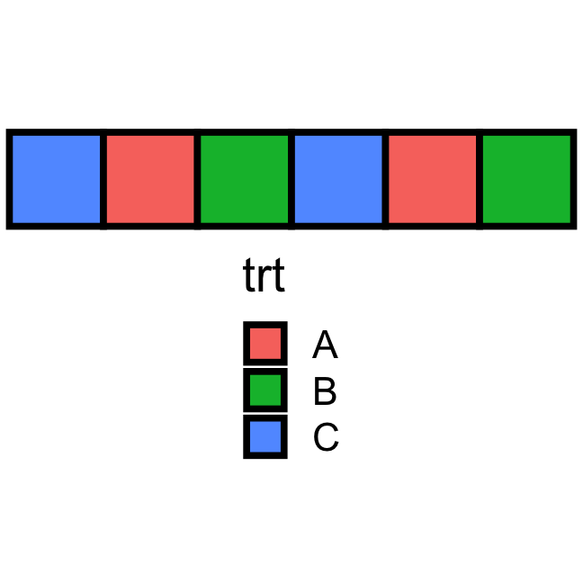

</div>

---


# `agricolae::design.rcbd`

**Randomised complete block design** for $t =3$ treatments with $2$ blocks

<pre><code>
trt <- c("A", "B", "C")
agricolae::.bg-yellow[design.rcbd](trt = trt, r = 2) %>% glimpse()
</code></pre>

.overflow-scroll.h---340[
```{r, echo = FALSE}
des <- agricolae::design.rcbd(trt = trt, r = 2)
glimpse(des)
```
]


```{r ggrcbd, fig.height = 3, fig.width = 3, fig.show="hide", echo = FALSE}
ggplot(des$book, aes(x = "", y = substr(plots, 3, 3), fill = trt)) + 
  geom_tile(color = "black", size = 1.2) + 
  coord_equal() +
  facet_wrap(~block) + 
  theme_void(base_size = 18) + 
  theme(legend.direction = "vertical")
```

<div class="plot-box" style="position:absolute;bottom: 100px; right: 50px;">

<br>

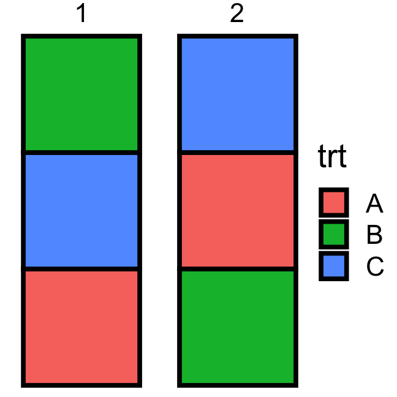

</div>


---


# `agricolae::design.lsd()`

**Latin square design** for $t = 3$ treatments

<pre><code>
trt <- c("A", "B", "C")
agricolae::.bg-yellow[design.lsd](trt = trt) %>% glimpse()
</code></pre>

.overflow-scroll.h---340[
```{r, echo = FALSE}
des <- agricolae::design.lsd(trt = trt)
glimpse(des)
```
]

```{r gglsd, fig.height = 3, fig.width = 3, fig.show = "hide", echo = FALSE}
ggplot(des$book, aes(x = col, y = row, fill = trt)) + 
  geom_tile(color = "black", size = 1.2) + 
  coord_equal() +
  theme_void(base_size = 18) + 
  theme(legend.direction = "vertical")
```

<div class="plot-box" style="position:absolute;top: 100px; right: 50px;">

<br>


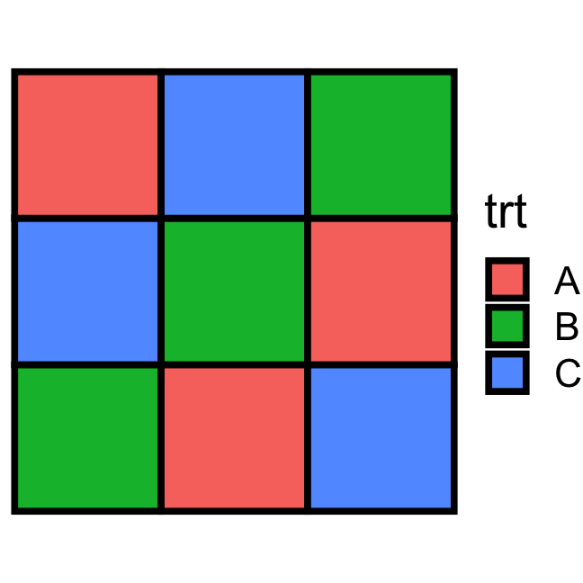

</div>


---


# `agricolae::design.bib()`

**Balanced incomplete block design** for $t = 3$ treatments with block size of $2$

<pre><code>
trt <- c("A", "B", "C")
agricolae::.bg-yellow[design.bib](trt = trt, k = 2) %>% glimpse()
</code></pre>

.overflow-scroll.h---340[
```{r, echo = FALSE}
des <- agricolae::design.bib(trt = trt, k = 2)
glimpse(des)
```
]

```{r ggbibd, fig.height = 3, fig.width = 3, fig.show="hide", echo = FALSE}
ggplot(des$book, aes(x = "", y = substr(plots, 3, 3), fill = trt)) + 
  geom_tile(color = "black", size = 1.2) + 
  coord_equal() +
  facet_wrap(~block) + 
  theme_void(base_size = 18) + 
  theme(legend.direction = "vertical")
```


<div class="plot-box" style="position:absolute;top: 200px; right: 50px;">

<br>

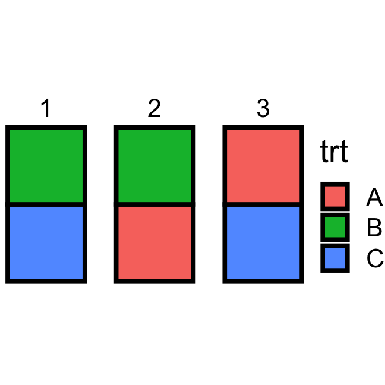

</div>


---

class: font_small

# `agricolae::design.ab()`

**Factorial design** for $t = 3 \times 2$ treatments with $2$ replication for each treatment

<pre><code>
agricolae::.bg-yellow[design.ab](trt = c(3, 2), r = 2, design = "crd") %>% glimpse()
</code></pre>

.overflow-scroll.h---340[
```{r, echo = FALSE}
des <- agricolae::design.ab(trt = c(3, 2), r = 2, design = "crd")
glimpse(des)
```
]

Note *not* A/B testing!


```{r ggfac, fig.height = 3.5, fig.width = 3, fig.show="hide", echo = FALSE}
des$book %>% 
  ggplot(aes(x = "", y = factor(plots))) + 
  geom_tile(aes(fill = A), color = "black", size = 1.2) + 
  geom_text(aes(color = B, label = B), show.legend = T, fontface = "bold") + 
  scale_color_manual(values = c("black", "brown")) +
  coord_equal() +
  theme_void(base_size = 18) + 
  theme(legend.direction = "vertical")
```

<div class="plot-box" style="position:absolute;top: 200px; right: 50px;">

<br>


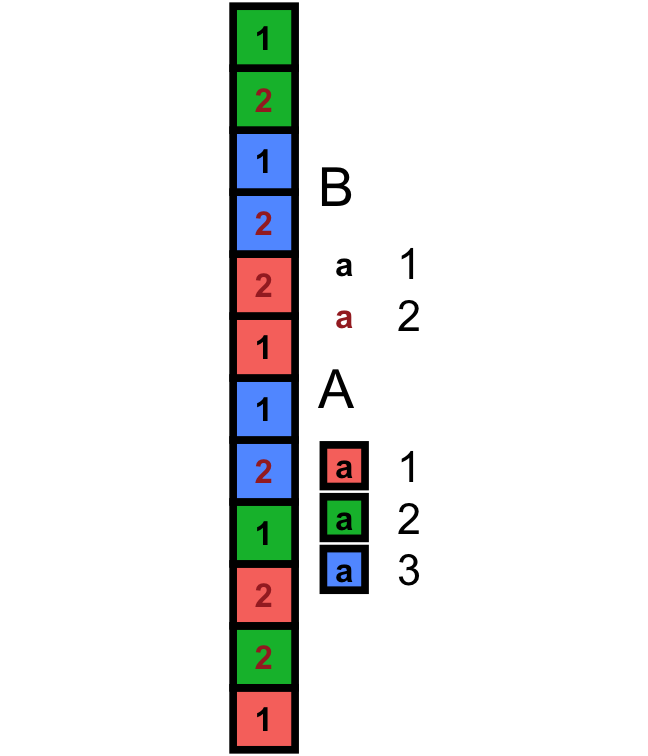

<br>

</div>


---

class: font_small

# `agricolae::design.split()`

**Split-plot design** for $t = 2 \times 4$ treatments with $2$ replication for each treatment

<pre><code>
trt1 <- c("I", "R"); trt2 <- LETTERS[1:4]
agricolae::.bg-yellow[design.split](trt1 = trt1, trt2 = trt2, r = 2, design = "crd") %>% 
    glimpse()
</code></pre>

.overflow-scroll.h---300[
```{r, echo = FALSE}
trt1 <- c("I", "R")
trt2 <- LETTERS[1:4]
des <- agricolae::design.split(trt1 = trt1, trt2 = trt2, r = 2, design = "crd")
glimpse(des)
```
]


```{r split-plot-graph, fig.height = 3.5, fig.width = 3, fig.show="hide", echo = FALSE}
levels(des$book$trt2) <- LETTERS[1:4]
des$book %>% 
  mutate(block = substring(plots, 3, 3)) %>% 
  ggplot(aes(x = "", y = splots)) + 
  geom_tile(aes(fill = trt1), color = "black", size = 1.2) + 
  geom_text(aes(color = trt2, label = trt2), show.legend = T, fontface = "bold") + 
  scale_color_manual(values = c("black", "brown", "darkviolet", "darkblue")) +
  facet_grid( . ~ block) +
  coord_equal() +
  theme_void(base_size = 18) + 
  theme(legend.direction = "vertical")
```

<div class="plot-box" style="position:absolute;top: 300px; right: 200px;">


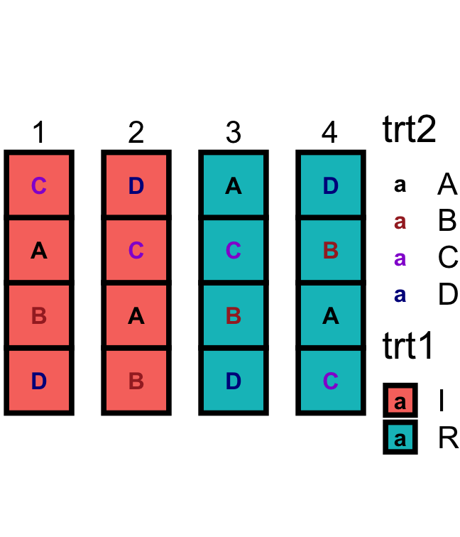

</div>


---

name: edibble

# 実験計画法の文法とは

* Base R プロット覚えてますか？ <a href="#base-plot" style="font-size:12pt"><i class="fas fa-caret-right"></i> base plot</a>
--

* 🤔 "named experimental design" functions (`agricolae::design.crd`, etc.) are like "named statistical graphic" functions (`pie`, `barplot`)
--

* 💡<i class="fas fa-wrench"></i> このコンセプトが `edibble` R-packageのもとです <br>https://github.com/emitanaka/edibble
--


名前の元
* `tibble` R-package とは modern reimagining of the `data.frame`
* `edibble` とは **e**xperimental **d**esign t**ibble**

.absolute.right-3.bottom-3[

]

.footnote.f4.monash-black[
Müller & Wickham (2020) tibble: Simple Data Frames. *R package version 3.0.3*
<br><br>
]

---


# `edibble` プロトタイプ


.flex[
.w-50[

* Consider a field experiment with 32 plots

]
.w-50.f4[
```{r, message=FALSE}
library(edibble)
start_design(name = "cochran.crd") %>% 
  set_units(plot = 32) #<<
```
]
]

---

count: false

# `edibble` プロトタイプ


.flex[
.w-50[

* Consider a field experiment with 32 plots
* There are 7 different treatments

]
.w-50.f4[
```{r, message = FALSE}
library(edibble)
start_design(name = "cochran.crd") %>% 
  set_units(plot = 32) %>% 
  set_trts(trt = c("F12", "F3", "F6", "O", #<<
                   "S12", "S3", "S6")) #<<
```


]
]

---

count: false

# `edibble` プロトタイプ


.flex[
.w-50[

* Consider a field experiment with 32 plots
* There are 7 different treatments
* Allocate treatments to plots

]
.w-50.f4[
```{r, message = FALSE}
library(edibble)
start_design(name = "cochran.crd") %>% 
  set_units(plot = 32) %>% 
  set_trts(trt = c("F12", "F3", "F6", "O", 
                   "S12", "S3", "S6")) %>% 
  allocate_trts(trt ~ plot) #<<
```


]
]

---

count: false

# `edibble` プロトタイプ


.flex[
.w-50[

* Consider a field experiment with 32 plots
* There are 7 different treatments
* Allocate treatments to plots
* Randomise treatments to plots

]
.w-50.f4[
```{r, message = FALSE}
library(edibble)
start_design(name = "cochran.crd") %>% 
  set_units(plot = 32) %>% 
  set_trts(trt = c("F12", "F3", "F6", "O", 
                   "S12", "S3", "S6")) %>% 
  allocate_trts(~ plot) %>% 
  randomise_trts() #<<
```


]
]

---

count: false

# `edibble` プロトタイプ

.flex[
.w-50[

* Consider a field experiment with 32 plots
* There are 7 different treatments
* Allocate treatments to plots
* Randomise treatments to plots
* The result is a **completely randomised design**

]
.w-50.h---500.f4.overflow-scroll[
```{r, message = FALSE}
library(edibble)
start_design(name = "cochran.crd") %>% 
  set_units(plot = 32) %>% 
  set_trts(trt = c("F12", "F3", "F6", "O", 
                   "S12", "S3", "S6")) %>% 
  allocate_trts(~ plot) %>% 
  randomise_trts() %>% 
  serve_table() #<<
```


]
]


---


# `edibble` プロトタイプ


.flex[
.w-50[

* Consider a field experiment with 2 blocks each with 16 plots
* There are 7 different treatments
* Allocate treatments to plots
* Randomise treatments to plots within blocks
* Resulting design is a **randomised block design**

<br>

前の実験研究法とどう違うか分かりますか？

]
.w-50.h---500.overflow-scroll.f4[
```{r, message = FALSE}
library(edibble)
start_design(name = "cochran.crd") %>% 
  set_units(block = c("B1", "B2"), #<<
            plot = nested_in(block, 16)) %>% #<<
  set_trts(trt = c("F12", "F3", "F6", "O", 
                   "S12", "S3", "S6")) %>% 
  allocate_trts(~ plot) %>% 
  randomise_trts() %>% 
  serve_table() 
```
]]

---

# `edibble` ユニット・ストラクチャー


```{r des, eval = FALSE}
start_design("complex unit structure") %>% 
  set_units(city = c("tokyo", "nagano", "sydney", "melbourne", "washington"),
            school = nested_in(city, 
                               "tokyo"  ~ 4,
                               "sydney" ~ 1,
                                      . ~ 2)) %>% 
  serve_table()
```
.h---240.overflow-scroll[
```{r des, echo = FALSE}
```
]

---

# `edibble` トリートメント・ストラクチャー

```{r des2, eval = FALSE}
des <- start_design(name = "Effective teaching") %>%
    set_units(class = 4,
              student = nested_in(class, 30)) %>%
    set_trts(style = c("flipped", "traditional"),
             exam = c("take-home", "open-book", "closed-book")) %>%
    allocate_trts(style ~ class,
                  exam ~ student) %>%
    randomise_trts()

print(serve_table(des), n = 120)
```
.h---150.overflow-scroll[
```{r des2, echo = FALSE}
```

]

---

# Recording variables in `edibble` ・記録

.f4[
```{r des3, eval = FALSE}
out <- des %>% 
    record_vars(student = c(mark, gender),
                  class = teacher) %>%
    expect_vars(mark = to_be_numeric(with_value(between = c(0, 100))),
              gender = to_be_factor(levels = c("female", "male", "other", "unknown"))) %>% 
    serve_table()

out
```

.h---240.overflow-scroll[
```{r, include = FALSE}
old_opts <- options()
options(width = 80)
```
```{r des3, echo = FALSE}
```

]]

---

# `edibble` アウトプット

```{r, eval = FALSE}
export_design(out, file = "design.xlsx")
```
```{r, include = FALSE}
export_design(out, file = "design.xlsx", overwrite = TRUE)
```

.center[
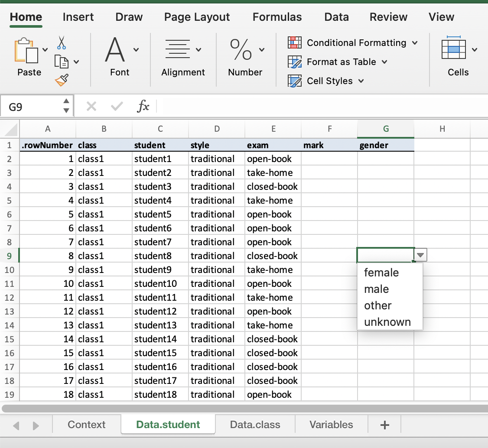 &nbsp;&nbsp;&nbsp; 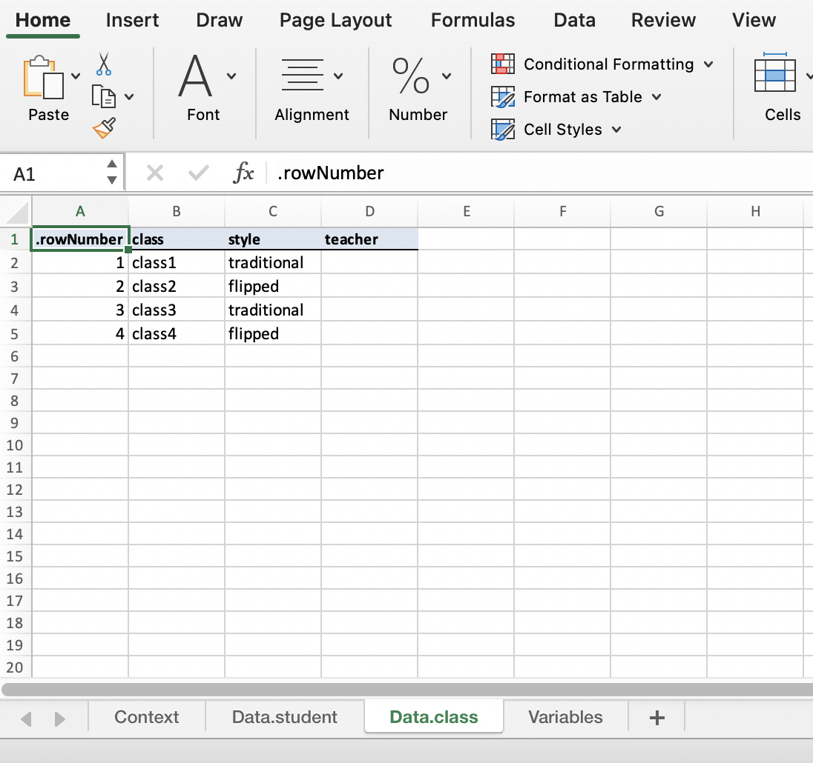
]

---

class: middle center


.f1[実験計画は重要です!]

<br>

.f1[`edibble`の目的は実験計画を容易にする事です]

.f1[[<i class="fas fa-link"></i> edibble.emitanaka.org](https://edibble.emitanaka.org/)]

--

<br>

.f1[🚧 `edibble`は開発中です]

<br>

.f1[コメントとフィードバックを歓迎します！]


---

layout: false
background-size: cover
class: title-slide
background-image: url("images/bg-03.png")


This slide is made using the `xaringan` R-package and found at

<br>

.w-80.center[
[emitanaka.org/slides/TokyoR2021](https://emitanaka.org/slides/TokyoR2021)

{{content}}

]


.bottom_abs.width100[

*`r rmarkdown::metadata$author`*

<i class="fas fa-university"></i> `r rmarkdown::metadata$department`, <Br>&nbsp;&nbsp;&nbsp;&nbsp;&nbsp;Monash University, Melbourne, Australia

<i class="fas fa-envelope"></i>  `r rmarkdown::metadata$email`

<a href="https://twitter.com/statsgen" style="color:black"><i class="fab fa-twitter"></i> @statsgen</a>


<br>

]

--

<br>

Thank you!

