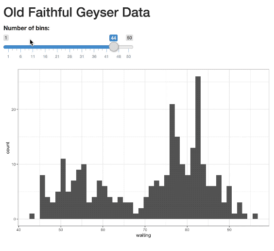
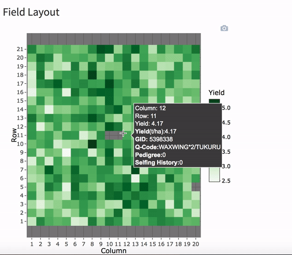
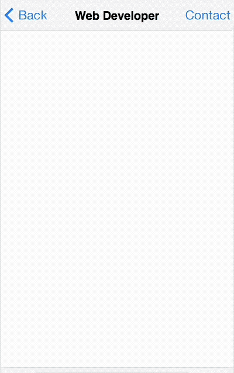
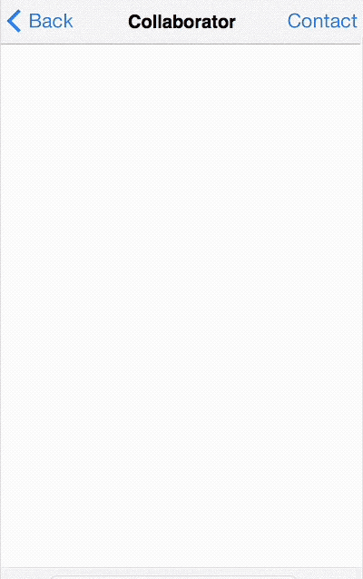
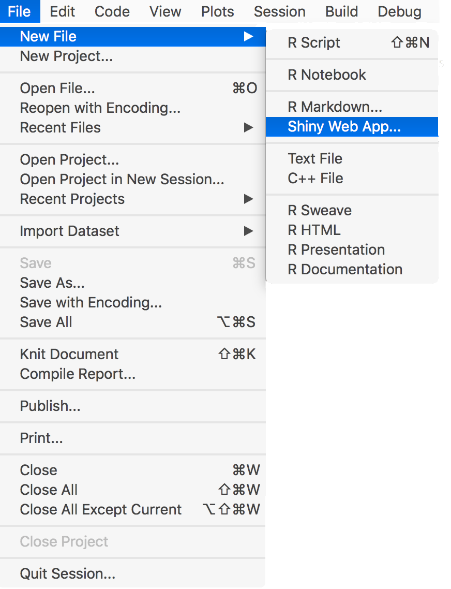
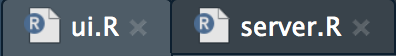
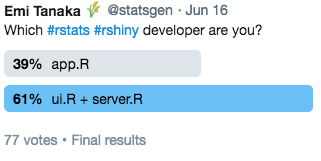
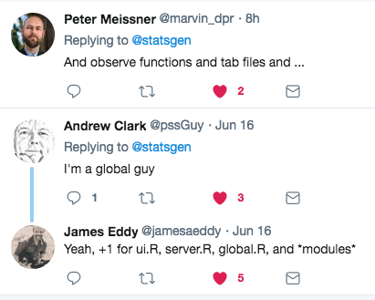

```{r setup, include=FALSE}
options(htmltools.dir.version = FALSE)

shinyglit <- glue::glue("<span class=\"glit\" data-text=\"{text}\">{text}</span>", text="Shiny")
shinyglit2 <- "<span class=\"glit2\">Shiny</span>"
```


class: title-slide

<br><br>
# .textshadow[Making a] `r shinyglit` .textshadow[interactive web application using `r anicon::faa("r-project", size=2, animate="pulse")`]
<br><br>
.pull-right[.gray[.textshadow[
* These slides are best viewed on Chrome. 
* Firefox is not rendering two columns correctly.
* Don't even get started with IE.]]]
<br>
## .textshadow[**Emi Tanaka**]


### .textshadow[June 20, 2018]

<br>

[.textshadow[.font120[`r anicon::faa("twitter", animate="float", color="white", rtext=".white[@statsgen]")`]]](http://twitter.com/statsgen)

<br><br><br>
---
class: center, middle

background-image: url("figures/beforeS.png")
background-position: 90% 70%
background-size: 200px

# `r icon::fa("r-project", size=2)` is great!


---

class: center, middle

background-image: url("figures/surprise.png")
background-position: 90% 70%
background-size: 200px

# `r icon::fa("r-project", size=2)` is great!

<br> 

## `r icon::ii_sad()` But not everyone knows `R`.  

---

class: center, middle

background-image: url("figures/handshake.png")
background-position: 90% 90%
background-size: 100px


# `r icon::fa("r-project", size=2)` is great!

<br> 

## `r icon::ii_sad()` But not everyone knows `R`.  


<br> 

## `r shinyglit` can bridge that gap between  non-`R` users and `R` users.


---

class: metroheader

.header[What is `r shinyglit2`?]

--

## `r icon::fa("info-circle", size=1.5)` `shiny` is a web application framework for `R` so it can do whatever `R` can do!


.pull-right[]

---

class: metroheader

.header[Why `r shinyglit2`?]
.columns-2[.font100[
* It's all done in `R` so you don't need to be a web developer to make an app!

&emsp;&emsp;&emsp;

<br><br><br><br><br><br><br><br><br><br><br><br><br><br><br><br><br><br><br><br><br><br><br><br><br><br><br>

]]


---

class: metroheader

.header[Why `r shinyglit2`?]
.columns-2[.font100[
* It's all done in `R` so you don't need to be a web developer to make an app!

&emsp;&emsp;&emsp;

* Let users easily explore the data. 

&emsp;&emsp;&emsp;

]]

---

class: metroheader

.header[How to get started with `r shinyglit2`?]
RStudio > File > New File > Shiny Web App
.center[]

---

class: metroheader

.header[There are two types of `r shinyglit2` developers]

&emsp;&emsp;&emsp;&emsp;&emsp;&emsp;&emsp;&emsp;&emsp;&emsp;&emsp;&emsp;&emsp;&emsp;&emsp;.font45[vs.]
.pull-right[&emsp;]
.columns-2[
`app.R`
```{r, eval=F}
ui <- fluidPage(
  titlePanel("Old Faithful Geyser Data"),
  sliderInput("bins", "Number of bins:",
               min = 1, max = 50,
               value = 30) ,
  plotOutput("distPlot")
)

server <- function(input, output) {
   output$distPlot <- renderPlot({
     ggplot(faithful, aes(waiting)) + geom_histogram(bins=input$bins) + theme_bw()
   })
}
```
<br><br><br><br>
`ui.R`
```{r, eval=F}
shinyUI(
  fluidPage(
    titlePanel("Old Faithful Geyser Data"),
    sliderInput("bins", "Number of bins:",
                min = 1, max = 50, value = 30) ,
    plotOutput("distPlot")
  )
)
```
`server.R`
```{r, eval=F}
shinyServer(function(input, output) {
  output$distPlot <- renderPlot({
    ggplot(faithful, aes(waiting)) + geom_histogram(bins=input$bins) + theme_bw()
  })
})
```

]


---

class: center


--

## Okay, truth is there are more than two types...



---

class: columns-2
background-image: url("figures/geyser-1.png")
background-position: 85% 80%
background-size: 400px

.pull-left[
`ui.R`
```{r, eval=F}
{{shinyUI}}(
  fluidPage(
    titlePanel("Old Faithful Geyser Data"),
    sliderInput("bins", "Number of bins:",
          min = 1, max = 50, value = 30),
    plotOutput("distPlot")
  )
)
```
`server.R`
```{r, eval=F}
shinyServer(function(input, output) {
  output$distPlot <- renderPlot({
    ggplot(faithful, aes(waiting)) + 
      geom_histogram(bins=input$bins) + 
      theme_bw()
  })
})
```
<br>
.content-box-yellow[`shinyUI` register the user-interface with Shiny (no longer required for Shiny 0.10 and beyond).

]

<br><br><br><br><br><br><br><br><br><br>
]

---

class: columns-2
background-image: url("figures/geyser-1.png")
background-position: 85% 80%
background-size: 400px

.pull-left[
`ui.R`
```{r, eval=F}
shinyUI(
{{ fluidPage(}}
    titlePanel("Old Faithful Geyser Data"),
    sliderInput("bins", "Number of bins:",
          min = 1, max = 50, value = 30),
    plotOutput("distPlot")
  )
)
```
`server.R`
```{r, eval=F}
shinyServer(function(input, output) {
  output$distPlot <- renderPlot({
    ggplot(faithful, aes(waiting)) + 
      geom_histogram(bins=input$bins) + 
      theme_bw()
  })
})
```
<br>
.content-box-yellow[`fluidPage` to let `R` know your about to create a page...

]

<br><br><br><br><br><br><br><br><br><br><br>
]

---

class: columns-2
background-image: url("figures/geyser-1.png")
background-position: 85% 80%
background-size: 400px

.pull-left[
`ui.R`
```{r, eval=F}
shinyUI(
  fluidPage(
  {{ titlePanel("Old Faithful Geyser Data"),}}
    sliderInput("bins", "Number of bins:",
          min = 1, max = 50, value = 30),
    plotOutput("distPlot")
  )
)
```
`server.R`
```{r, eval=F}
shinyServer(function(input, output) {
  output$distPlot <- renderPlot({
    ggplot(faithful, aes(waiting)) + 
      geom_histogram(bins=input$bins) + 
      theme_bw()
  })
})
```
<br>
.content-box-yellow[... which contains a title, ...

]

<br><br><br><br><br><br><br><br><br><br><br><br>
]

---

class: columns-2
background-image: url("figures/geyser-1.png")
background-position: 85% 80%
background-size: 400px

.pull-left[
`ui.R`
```{r, eval=F}
shinyUI(
  fluidPage(
    titlePanel("Old Faithful Geyser Data"),
  {{ sliderInput("bins", "Number of bins:",
         min = 1, max = 50, value = 30),}}
    plotOutput("distPlot")
  )
)
```
`server.R`
```{r, eval=F}
shinyServer(function(input, output) {
  output$distPlot <- renderPlot({
    ggplot(faithful, aes(waiting)) + 
      geom_histogram(bins=input$bins) + 
      theme_bw()
  })
})
```
<br>
.content-box-yellow[... a slider stemming from 1 to 50 with default value 30 contained in `bins`, ...

]

<br><br><br><br><br><br><br><br><br><br><br>
]

---

class: columns-2
background-image: url("figures/geyser-1.png")
background-position: 85% 80%
background-size: 400px

.pull-left[
`ui.R`
```{r, eval=F}
shinyUI(
  fluidPage(
    titlePanel("Old Faithful Geyser Data"),
    sliderInput("bins", "Number of bins:",
          min = 1, max = 50, value = 30),
  {{ plotOutput("distPlot")}}
  )
)
```
`server.R`
```{r, eval=F}
shinyServer(function(input, output) {
  output$distPlot <- renderPlot({
    ggplot(faithful, aes(waiting)) + 
      geom_histogram(bins=input$bins) + 
      theme_bw()
  })
})
```
<br>
.content-box-yellow[... and plot `distPlot` output.

]

<br><br><br><br><br><br><br><br><br><br><br><br>
]

---

class: columns-2
background-image: url("figures/geyser-1.png")
background-position: 85% 80%
background-size: 400px

.pull-left[
`ui.R`
```{r, eval=F}
shinyUI(
  fluidPage(
    titlePanel("Old Faithful Geyser Data"),
    sliderInput("bins", "Number of bins:",
          min = 1, max = 50, value = 30),
    plotOutput("distPlot")
  )
)
```
`server.R`
```{r, eval=F}
shinyServer(function(input, output) {
{{ output$distPlot <- renderPlot({
   ggplot(faithful, aes(waiting)) + 
     geom_histogram(bins=input$bins) + 
     theme_bw()
 })}}
})
```
<br>
.content-box-yellow[The `distPlot` output is rendered in the server side with a histogram from `ggplot2`. 

]

<br><br><br><br><br><br><br><br><br><br><br>
]

---

class: columns-2
background-image: url("figures/geyser-1.png")
background-position: 85% 80%
background-size: 400px

.pull-left[
`ui.R`
```{r, eval=F}
shinyUI(
  fluidPage(
    titlePanel("Old Faithful Geyser Data"),
    sliderInput("bins", "Number of bins:",
          min = 1, max = 50, value = 30),
    plotOutput("distPlot")
  )
)
```
`server.R`
```{r, eval=F}
shinyServer(function(input, output) {
  output$distPlot <- renderPlot({
    ggplot(faithful, aes(waiting)) + 
   {{  geom_histogram(bins=input$bins) + }}
      theme_bw()
  })
})
```
<br>
.content-box-yellow[`input$bins` contains the value specified in the user interface. 

]

<br><br><br><br><br><br><br><br><br><br><br>
]

---

class: middle, center

# And that's it! 

# You will have the bin-varying histogram <span class="glit">Shiny</span> app!


---

class: title-slide

<br><br><br><br>

# .textshadow[Thank you!]
<br><br><br>


## .textshadow[**Emi Tanaka**]

[.textshadow[.font120[.white[`r anicon::faa("twitter", animate="float")` @statsgen]]]](http://twitter.com/statsgen)

.textshadow[.font120[.white[`r anicon::faa("envelope", animate="shake", anitype="parent-hover", rtext="emi.tanaka@sydney.edu.au")`]]]

[.textshadow[.font120[`r anicon::faa("link", animate="burst", anitype="parent-hover", color="white", rtext=".white[slides at] .gray[bit.ly/sydrladies-shiny]")`]]](bit.ly/sydrladies-shiny)

[.textshadow[.font120[`r anicon::faa("github", animate="ring", anitype="parent-hover", color="white", rtext=".white[code available at] .gray[bit.ly/sydrladies-shiny]")`]]](bit.ly/sydrladies-shiny)


.footnote[&emsp;&emsp;&emsp;&emsp;&emsp;&emsp;&emsp;.textshadow[Thanks to Francis Hui, [.white[Sarah Romanes]](http://twitter.com/sarah_romanes) and [.white[Garth Tarr]](http://twitter.com/garthtarr) for inspirations!]]

